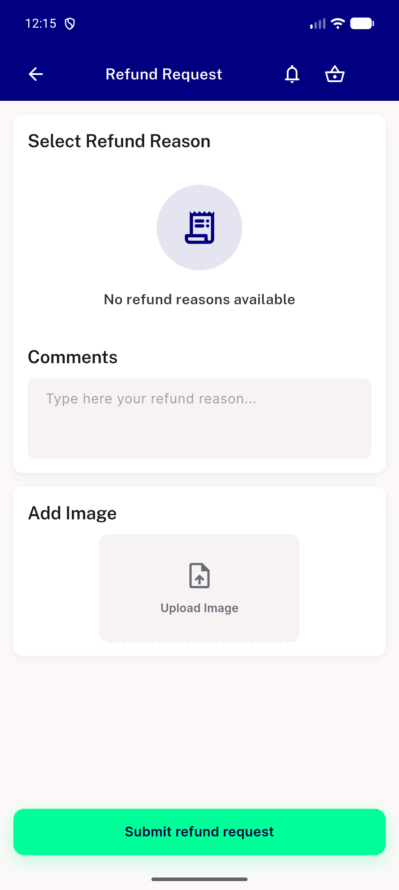
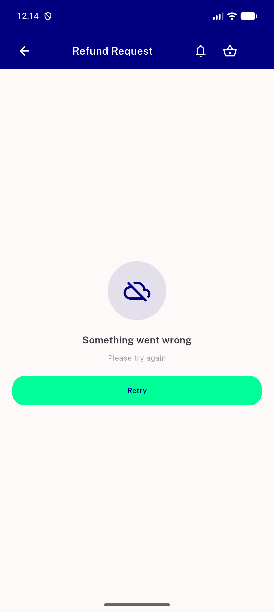
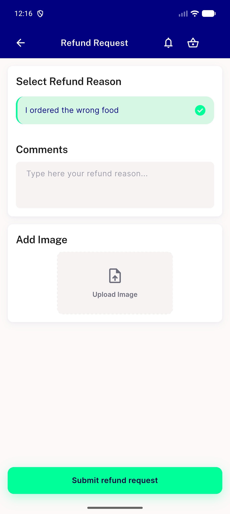
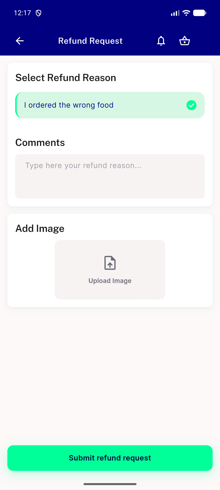
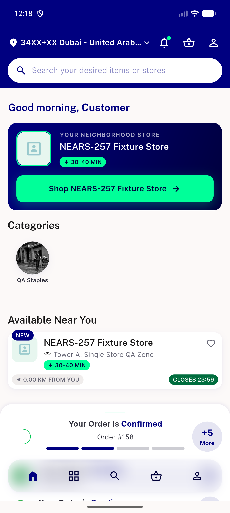
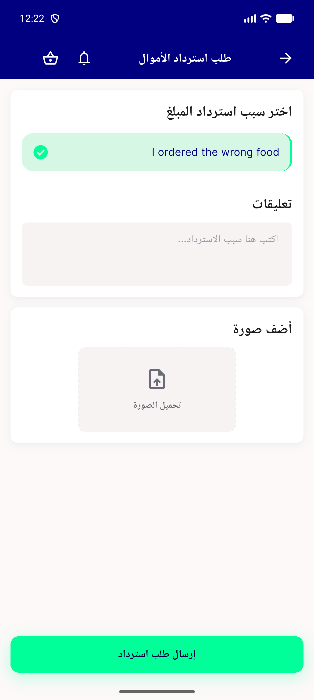
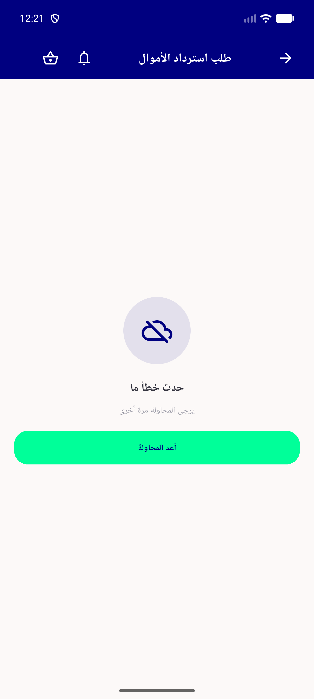

# QA Evidence — NEARS-2696

**PASS -- refund_request_screen error/retry state, emulator-5556**

**7 screenshot(s).** Click any thumbnail for full resolution.

<table>
<tr>
<td align="center" width="33%"> ac1 boundary empty state</td>
<td align="center" width="33%"> ac1 error retry</td>
<td align="center" width="33%"> ac2 submit 5xx snackbar</td>
</tr>
<tr>
<td align="center" width="33%"> ac2 submit drop snackbar</td>
<td align="center" width="33%"> ac4 success home</td>
<td align="center" width="33%"> regression reason select comment image</td>
</tr>
<tr>
<td align="center" width="33%"> rtl arabic error retry</td>
</tr>
</table>

---
*From `nears/docs/qa-evidence/NEARS-2696/` · public-repo scrub policy (no live secrets; verified clean).*
