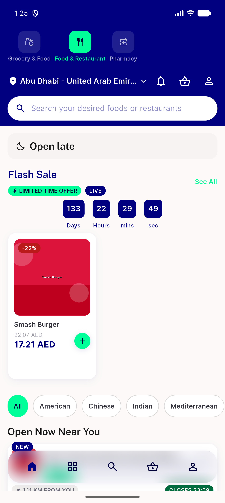

# QA Evidence — NEARS-2698

**PASS — AC1 live-demonstrated (real push, clean back-pop, no exit, no crash); AC2 verified via widget test (root state unreachable live, see QA comment); 166/166 location tests pass**

**1 screenshot(s).** Click any thumbnail for full resolution.

<table>
<tr>
<td align="center" width="33%"> back pop lands on home</td>
</tr>
</table>

---
*From `nears/docs/qa-evidence/NEARS-2698/` · public-repo scrub policy (no live secrets; verified clean).*
