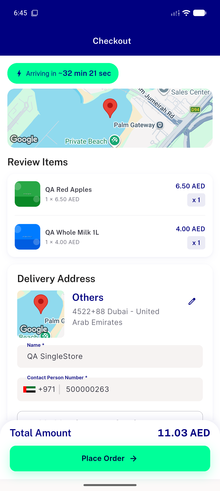

# QA Evidence — NEARS-2701

**PASS -- QA fixture distance-shape fix verified live, emulator-5556**

**2 screenshot(s).** Click any thumbnail for full resolution.

<table>
<tr>
<td align="center" width="33%"> ac3 checkout real distance</td>
<td align="center" width="33%"> ac3 checkout tower a address</td>
</tr>
</table>

### Other artifacts
- [`ac1-distance-api-curl.log`](ac1-distance-api-curl.log)

---
*From `nears/docs/qa-evidence/NEARS-2701/` · public-repo scrub policy (no live secrets; verified clean).*
