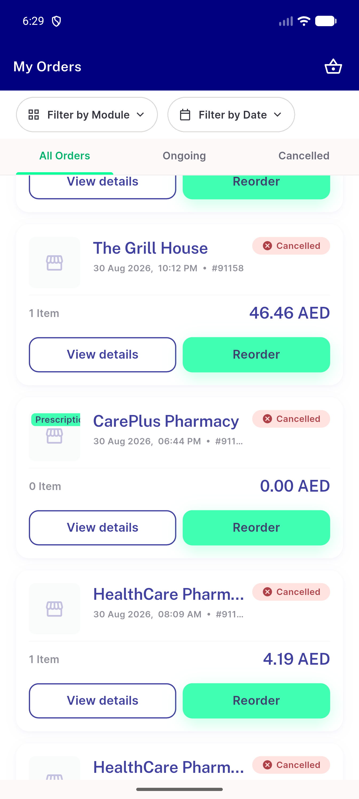
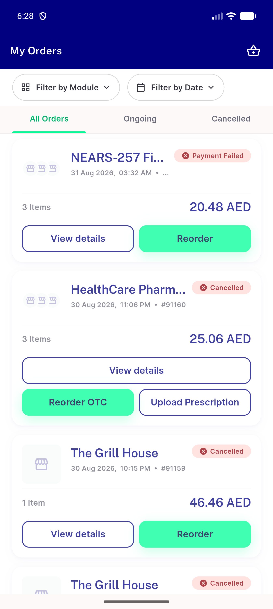

# QA Evidence — NEARS-2704

**PASS — pharmacy Rx-line gate: AC1-AC5 demonstrated live, backend+frontend automated tests green, no regressions**

**3 screenshot(s).** Click any thumbnail for full resolution.

<table>
<tr>
<td align="center" width="33%"> ac1 order 91147 plain reorder</td>
<td align="center" width="33%"> ac2 order 91160 mixed split</td>
<td align="center" width="33%"> regression nonpharmacy 91159 plain reorder</td>
</tr>
</table>

### Other artifacts
- [`ac3-reorder-otc-request-count.log`](ac3-reorder-otc-request-count.log)
- [`ac4-api-response-has_prescription_line.log`](ac4-api-response-has_prescription_line.log)

---
*From `nears/docs/qa-evidence/NEARS-2704/` · public-repo scrub policy (no live secrets; verified clean).*
