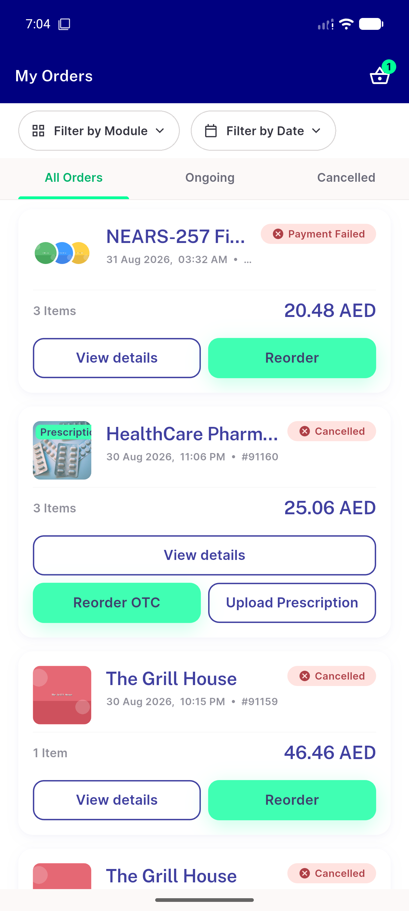
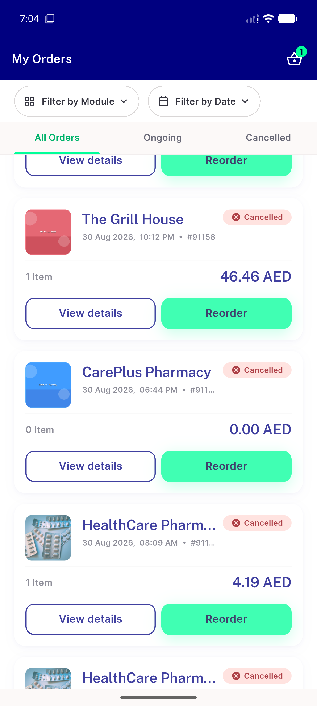
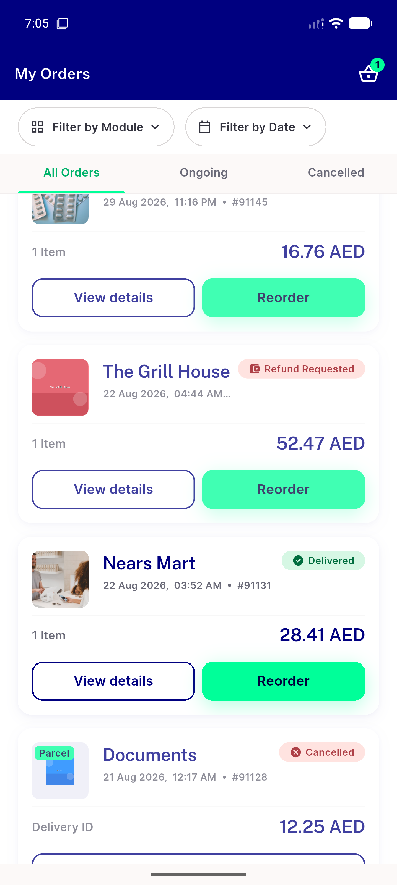

# QA Evidence — NEARS-2705

**PASS - AC1-4 demonstrated live, badge/split co-occurrence verified, regression clean**

**3 screenshot(s).** Click any thumbnail for full resolution.

<table>
<tr>
<td align="center" width="33%"> ac1 ac3 order91160 prescription badge split</td>
<td align="center" width="33%"> ac2 order91147 no badge</td>
<td align="center" width="33%"> regression parcel order91128 unaffected</td>
</tr>
</table>

---
*From `nears/docs/qa-evidence/NEARS-2705/` · public-repo scrub policy (no live secrets; verified clean).*
