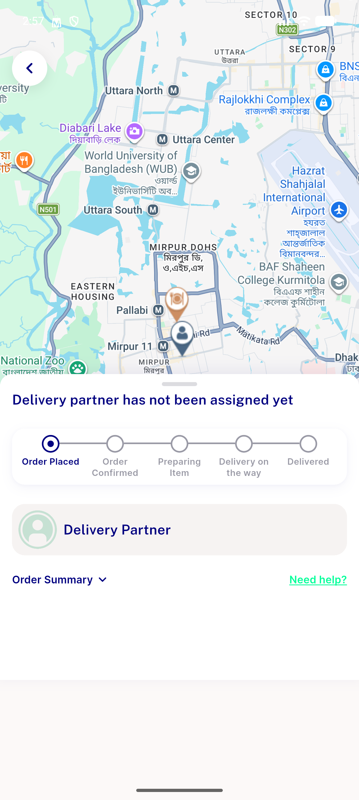

# QA Evidence — NEARS-2706

**PASS — AC1 DB phone confirmed +971566000002, AC2 live checkout Place Order succeeded (orderID=91162) with no phone-validation snackbar, no unrelated regression, checkout-reentry crash flagged as pre-existing regression_bug**

**1 screenshot(s).** Click any thumbnail for full resolution.

<table>
<tr>
<td align="center" width="33%"> ac2 order placed</td>
</tr>
</table>

### Other artifacts
- [`bug-checkout-reentry-setstate-during-build.log`](bug-checkout-reentry-setstate-during-build.log)

---
*From `nears/docs/qa-evidence/NEARS-2706/` · public-repo scrub policy (no live secrets; verified clean).*
