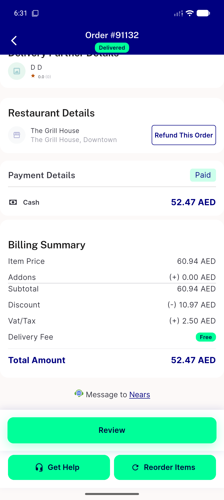

# QA Evidence — NEARS-2707

**PASS -- migration verified applied (refund_active_status=1), refund entry point + submit demonstrated live (order 91132, HTTP 200, order_status=refund_requested), guest-IDOR blocked live (order 91130, HTTP 404, 5/5 automated tests pass)**

**1 screenshot(s).** Click any thumbnail for full resolution.

<table>
<tr>
<td align="center" width="33%"> ac2 refund entry point order 91132</td>
</tr>
</table>

### Other artifacts
- [`ac1-db-verification.log`](ac1-db-verification.log)
- [`ac4-guest-idor-api-check.log`](ac4-guest-idor-api-check.log)

---
*From `nears/docs/qa-evidence/NEARS-2707/` · public-repo scrub policy (no live secrets; verified clean).*
