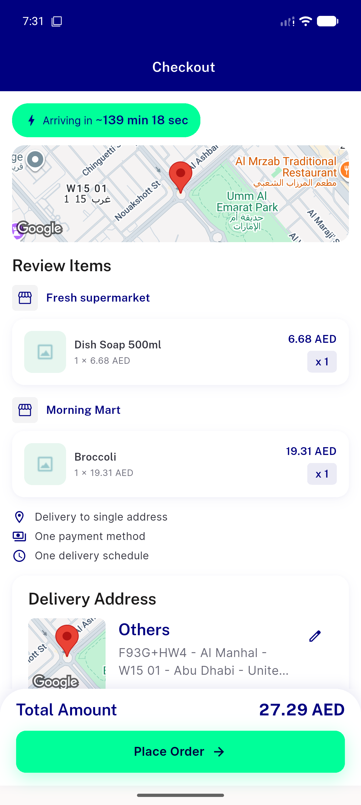

# QA Evidence — NEARS-2708

**PASS — backend-only observability fix verified live: AC1 root-cause spot-check clean, AC2 reason-field taxonomy confirmed live (non_ok_status + bonus route_exists_no_distance), client fallback unchanged, AC3 no charge regression, response-shape parity confirmed, regression sweep clean. Automated backstop 16/16 green.**

**1 screenshot(s).** Click any thumbnail for full resolution.

<table>
<tr>
<td align="center" width="33%"> checkout fallback ac2</td>
</tr>
</table>

### Other artifacts
- [`ac1-ac2-log-evidence.log`](ac1-ac2-log-evidence.log)
- [`ac2-client-fallback-and-shape-parity.log`](ac2-client-fallback-and-shape-parity.log)
- [`regression-sweep-ui-errors.log`](regression-sweep-ui-errors.log)

---
*From `nears/docs/qa-evidence/NEARS-2708/` · public-repo scrub policy (no live secrets; verified clean).*
