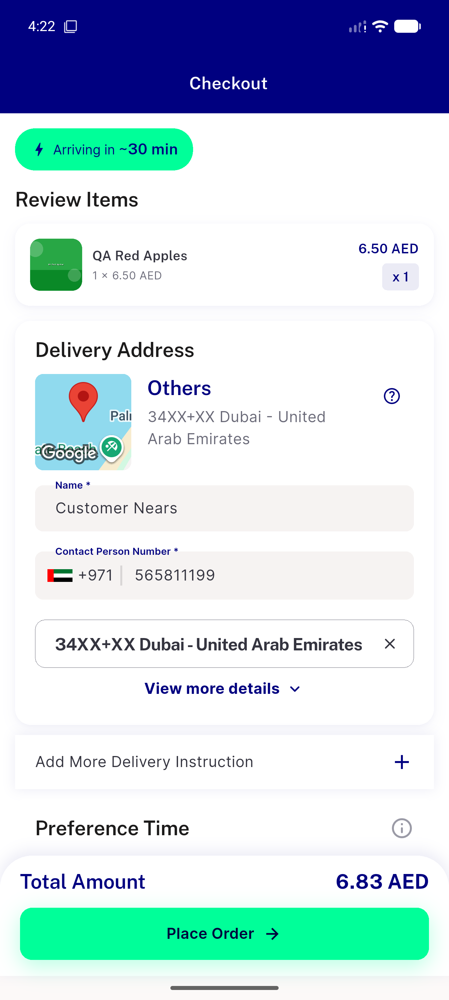
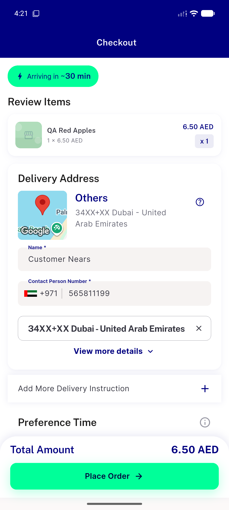
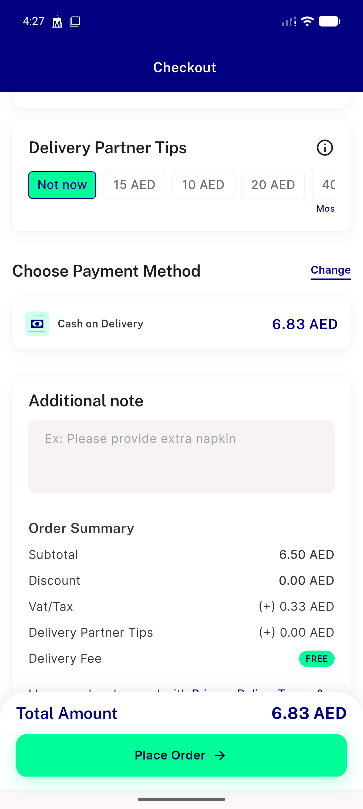

# QA Evidence — NEARS-2709

**PASS — checkout re-entry setState-during-build fix verified live (5x re-entry, clean); AC2 not regressed; automated 42/42**

**3 screenshot(s).** Click any thumbnail for full resolution.

<table>
<tr>
<td align="center" width="33%"> ac1 checkout second entry fixed</td>
<td align="center" width="33%"> ac2 checkout first entry shimmer</td>
<td align="center" width="33%"> regression checkout payment and order summary</td>
</tr>
</table>

---
*From `nears/docs/qa-evidence/NEARS-2709/` · public-repo scrub policy (no live secrets; verified clean).*
