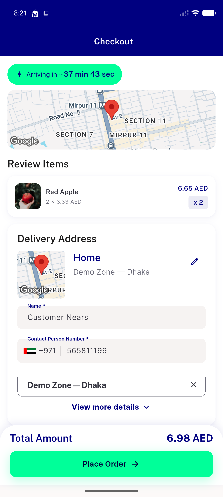

# QA Evidence — NEARS-2710

**PASS — checkout distance-response shape fix verified live: WARN classification for ROUTE_EXISTS-degenerate near-zero pairs, ERR/FAIL path unchanged for genuine ROUTE_NOT_FOUND, group-checkout path fixed identically, backend log correlation confirmed, 3 real orders placed cleanly (#91165 single-store WARN case, #91169-91171 group multi-store mixed WARN+FAIL case, #91172 happy-path).**

**1 screenshot(s).** Click any thumbnail for full resolution.

<table>
<tr>
<td align="center" width="33%"> ac3 happy path checkout</td>
</tr>
</table>

---
*From `nears/docs/qa-evidence/NEARS-2710/` · public-repo scrub policy (no live secrets; verified clean).*
