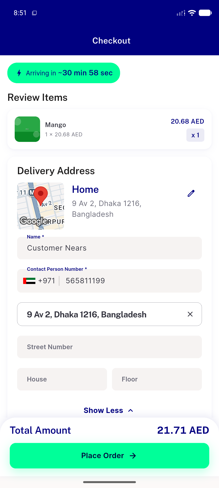
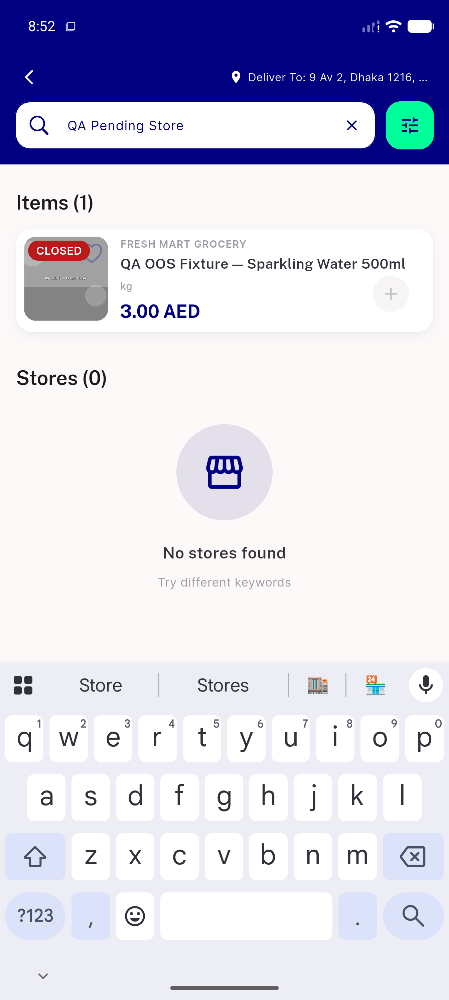
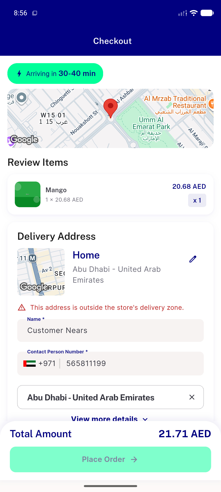
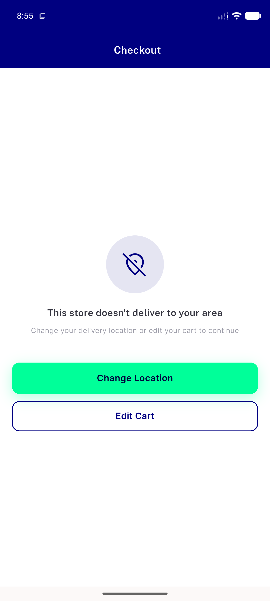

# QA Evidence — NEARS-2712

**PASS: close-with-proof — 3-leg live demonstration confirms no distinct defect (covered by NEARS-2701/2708/2710)**

**4 screenshot(s).** Click any thumbnail for full resolution.

<table>
<tr>
<td align="center" width="33%"> leg1 happy path checkout</td>
<td align="center" width="33%"> leg2 store 91108 not selectable</td>
<td align="center" width="33%"> leg3 crosszone checkout fallback err</td>
</tr>
<tr>
<td align="center" width="33%"> leg3a crosszone cart blocked gracefully</td>
</tr>
</table>

---
*From `nears/docs/qa-evidence/NEARS-2712/` · public-repo scrub policy (no live secrets; verified clean).*
