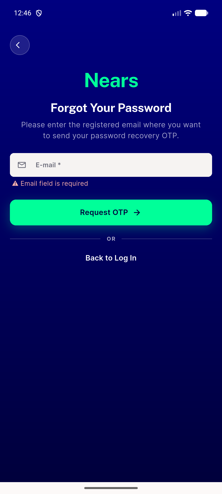
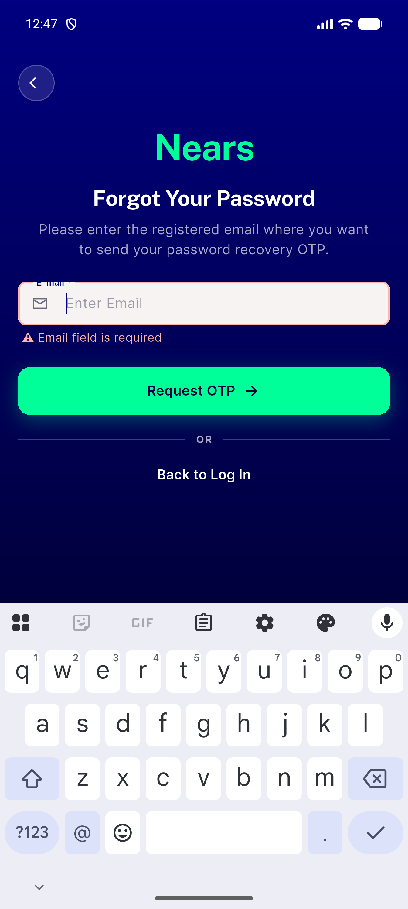
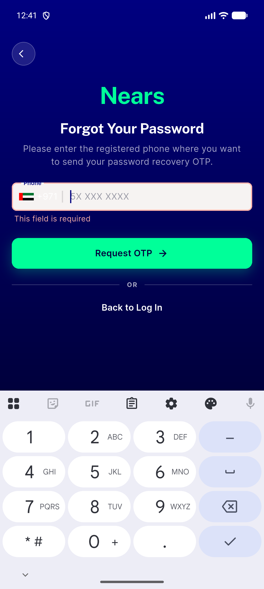
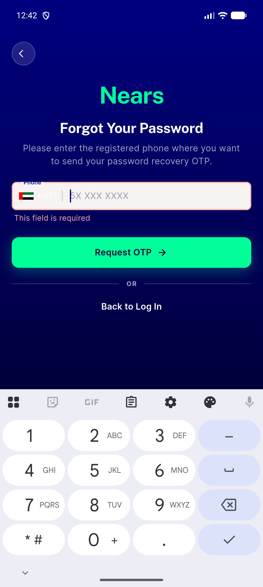
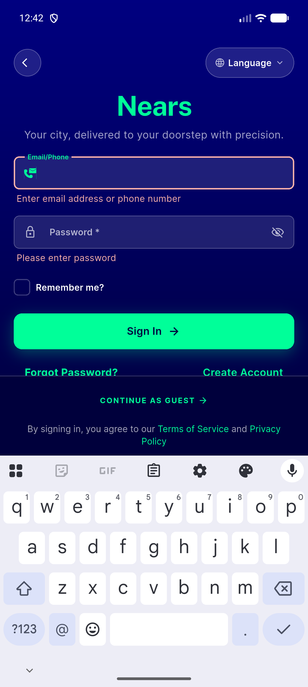

# QA Evidence — NEARS-2718

**PASS — AC1/AC2/AC3 verified live, errorDark #FFB4AB contrast confirmed via pixel sample against navy backdrop**

**5 screenshot(s).** Click any thumbnail for full resolution.

<table>
<tr>
<td align="center" width="33%"> ac1 email error</td>
<td align="center" width="33%"> ac1 email focused error</td>
<td align="center" width="33%"> ac2 phone error</td>
</tr>
<tr>
<td align="center" width="33%"> ac2 phone focused error</td>
<td align="center" width="33%"> ac3 signin error</td>
</tr>
</table>

---
*From `nears/docs/qa-evidence/NEARS-2718/` · public-repo scrub policy (no live secrets; verified clean).*
