# QA Evidence — NEARS-2719

**QA PASS — active-tile focus ring outline(0x767684) confirmed live LTR+RTL short/long-label, unselected mint ring regression-clean**

**20 screenshot(s).** Click any thumbnail for full resolution.

<table>
<tr>
<td align="center" width="33%"><a href="ac1-ltr-food-focused.png">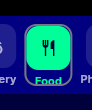</a> ac1 ltr food focused</td>
<td align="center" width="33%"><a href="ac1-ltr-food-unfocused.png">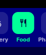</a> ac1 ltr food unfocused</td>
<td align="center" width="33%"><a href="ac1-ltr-pharmacy-focused.png">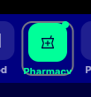</a> ac1 ltr pharmacy focused</td>
</tr>
<tr>
<td align="center" width="33%"> ac1 ltr pharmacy unfocused</td>
<td align="center" width="33%"><a href="ac2-rtl-food-focused.png">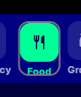</a> ac2 rtl food focused</td>
<td align="center" width="33%"><a href="ac2-rtl-food-unfocused.png">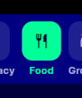</a> ac2 rtl food unfocused</td>
</tr>
<tr>
<td align="center" width="33%"><a href="ac2-rtl-pharmacy-focused.png">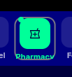</a> ac2 rtl pharmacy focused</td>
<td align="center" width="33%"><a href="ac2-rtl-pharmacy-unfocused.png">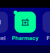</a> ac2 rtl pharmacy unfocused</td>
<td align="center" width="33%"><a href="ac3-ltr-grocery-focused.png">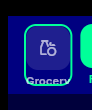</a> ac3 ltr grocery focused</td>
</tr>
<tr>
<td align="center" width="33%"><a href="ac3-ltr-grocery-unfocused.png">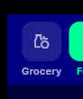</a> ac3 ltr grocery unfocused</td>
<td align="center" width="33%"><a href="ac3-rtl-grocery-focused.png">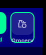</a> ac3 rtl grocery focused</td>
<td align="center" width="33%"><a href="ac3-rtl-grocery-unfocused.png">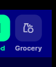</a> ac3 rtl grocery unfocused</td>
</tr>
<tr>
<td align="center" width="33%"><a href="long_ltr_hardware_focused_zoom4x.png">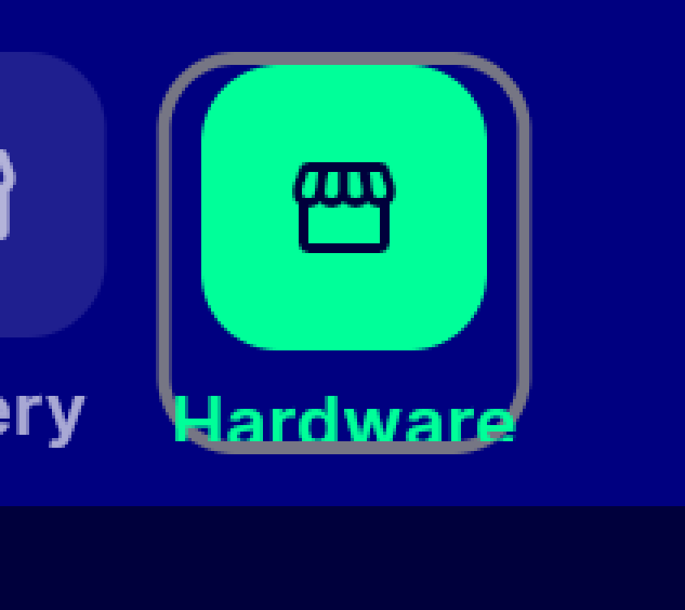</a> long ltr hardware focused zoom4x</td>
<td align="center" width="33%"><a href="long_ltr_hardware_unfocused_zoom4x.png">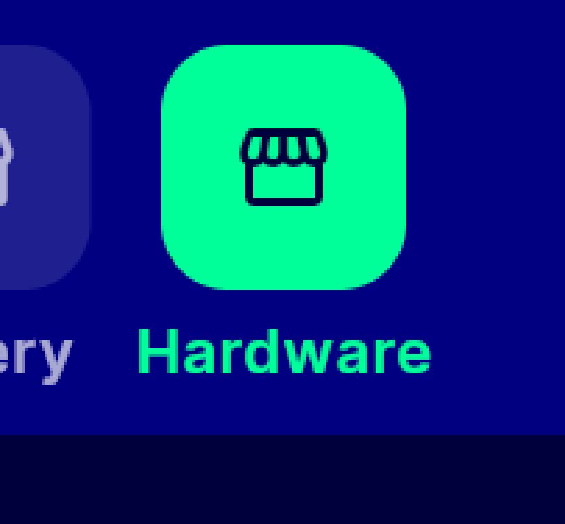</a> long ltr hardware unfocused zoom4x</td>
<td align="center" width="33%"><a href="long_rtl_hardware_focused_zoom4x.png">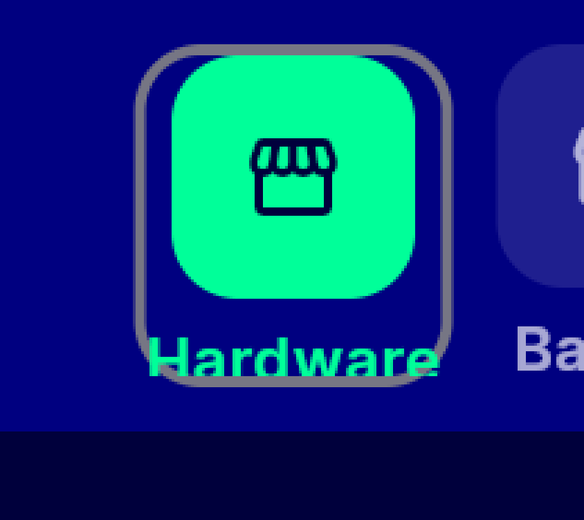</a> long rtl hardware focused zoom4x</td>
</tr>
<tr>
<td align="center" width="33%"><a href="short_ltr_food_focused_zoom4x.png">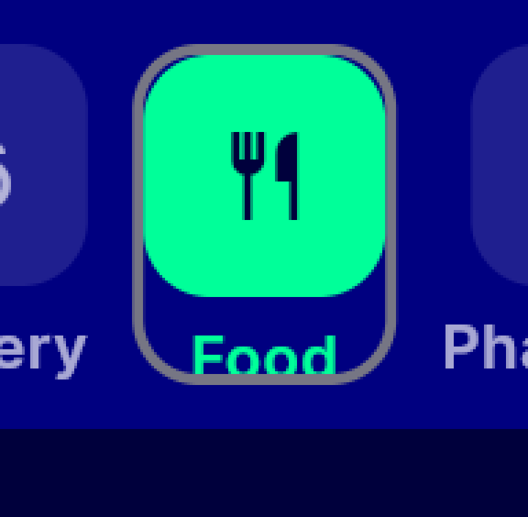</a> short ltr food focused zoom4x</td>
<td align="center" width="33%"><a href="short_ltr_food_unfocused_zoom4x.png">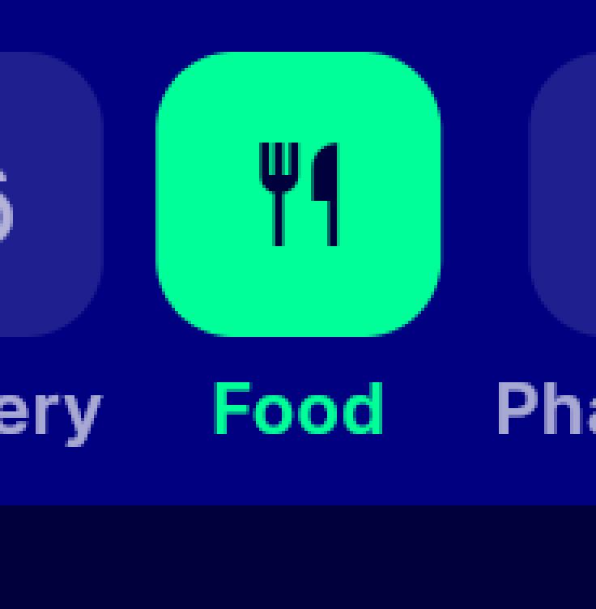</a> short ltr food unfocused zoom4x</td>
<td align="center" width="33%"><a href="short_rtl_food_focused_zoom4x.png">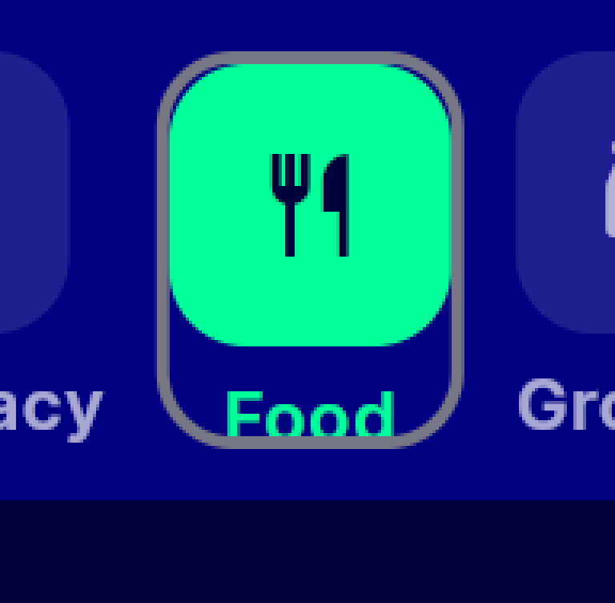</a> short rtl food focused zoom4x</td>
</tr>
<tr>
<td align="center" width="33%"><a href="unselected_ltr_grocery_focused_zoom4x.png">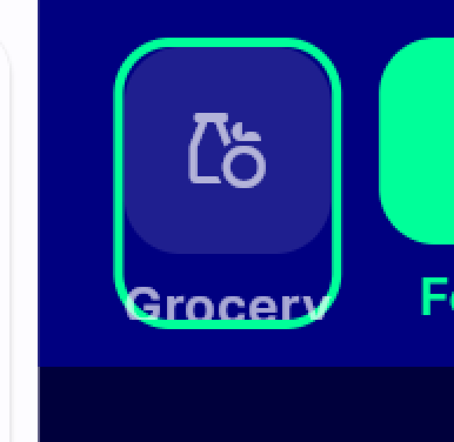</a> unselected ltr grocery focused zoom4x</td>
<td align="center" width="33%"><a href="unselected_ltr_grocery_unfocused_zoom4x.png">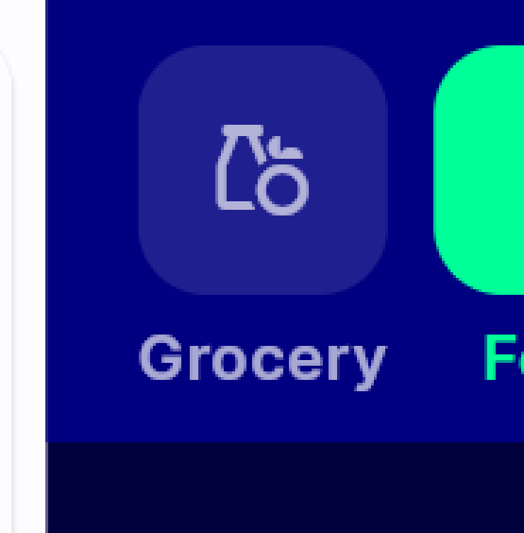</a> unselected ltr grocery unfocused zoom4x</td>
</tr>
</table>

### Other artifacts
- [`results.json`](results.json)
- [`results_rtl.json`](results_rtl.json)

---
*From `nears/docs/qa-evidence/NEARS-2719/` · public-repo scrub policy (no live secrets; verified clean).*
