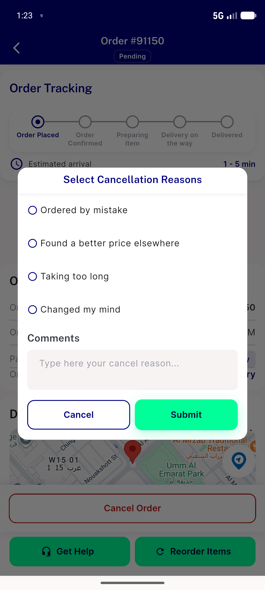
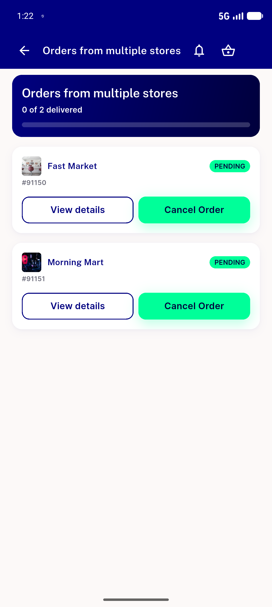
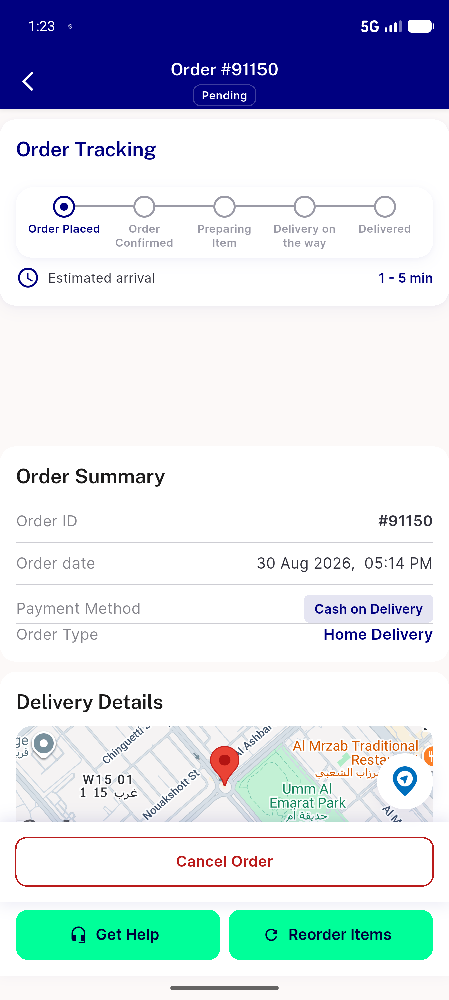

# QA Evidence — NEARS-2720

**PASS — AC2 demonstrated live (light mode, 3 real screens); AC1/AC3 dark-theme legs policy-blocked (light-first QA), corroborated by automated backstop (RED->GREEN pinned contrast test + 1518/1518 nears_dls suite + golden dark test)**

**3 screenshot(s).** Click any thumbnail for full resolution.

<table>
<tr>
<td align="center" width="33%"> ac2 ac3 cancellation dialogue light</td>
<td align="center" width="33%"> ac2 group tracking light</td>
<td align="center" width="33%"> ac2 order details override light</td>
</tr>
</table>

---
*From `nears/docs/qa-evidence/NEARS-2720/` · public-repo scrub policy (no live secrets; verified clean).*
