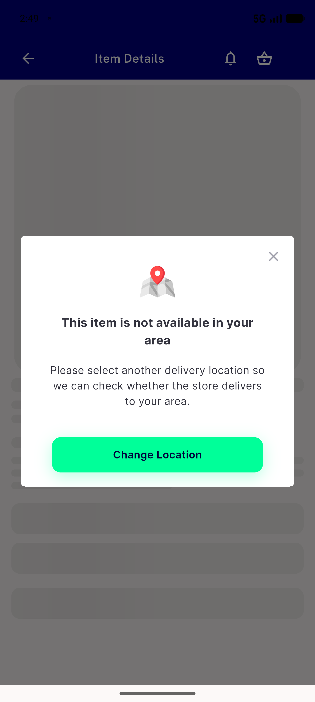
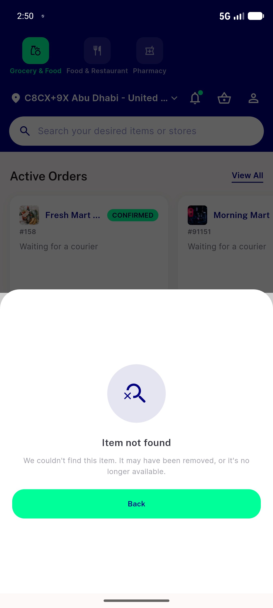

# QA Evidence — NEARS-2721

**PASS — cold-start item-details deep link 403 fix verified (AC1-AC3, AC5 live; AC4 unverifiable-by-design, alt evidence gathered)**

**3 screenshot(s).** Click any thumbnail for full resolution.

<table>
<tr>
<td align="center" width="33%"> ac1 coldstart item details success</td>
<td align="center" width="33%"> ac2 coldstart outofzone item39</td>
<td align="center" width="33%"> ac3 coldstart notfound item999999</td>
</tr>
</table>

### Other artifacts
- [`ac4-log-absence-check-investigation.log`](ac4-log-absence-check-investigation.log)

---
*From `nears/docs/qa-evidence/NEARS-2721/` · public-repo scrub policy (no live secrets; verified clean).*
