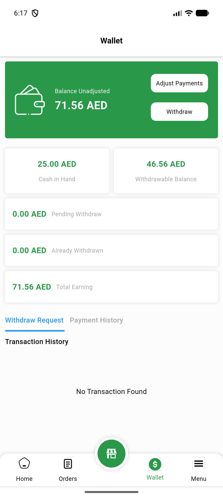
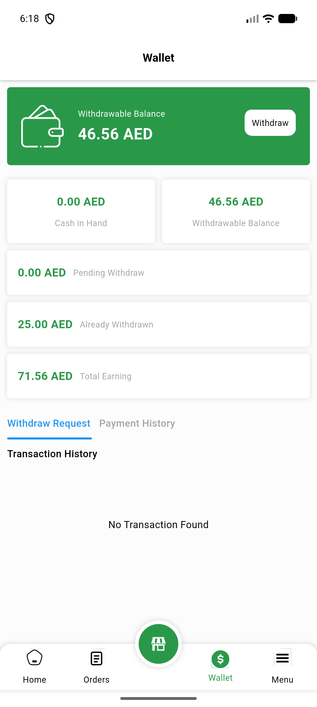
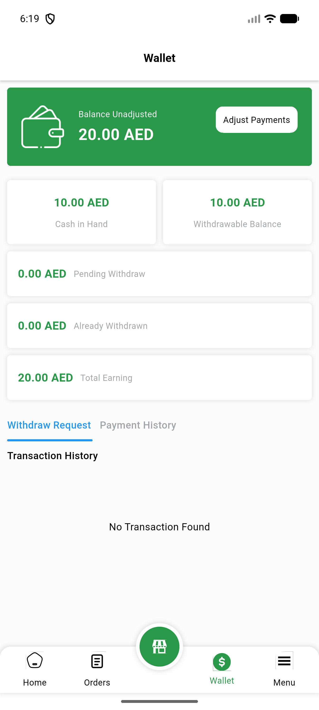
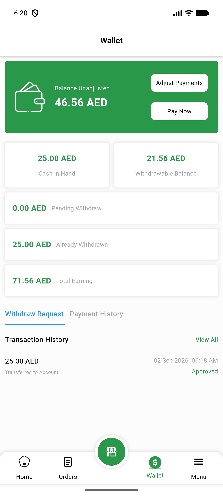

# QA Evidence — NEARS-2722

**PASS - VendorApp wallet adjust_able fixture verified live on emulator-5554, both AC1+AC2 paths demonstrated, regression clean**

**4 screenshot(s).** Click any thumbnail for full resolution.

<table>
<tr>
<td align="center" width="33%"> ac1 demo store wallet</td>
<td align="center" width="33%"> ac2a consumed demo store</td>
<td align="center" width="33%"> ac2b fallback organicshop wallet</td>
</tr>
<tr>
<td align="center" width="33%"> ac2c restored demo store</td>
</tr>
</table>

### Other artifacts
- [`progress.md`](progress.md)

---
*From `nears/docs/qa-evidence/NEARS-2722/` · public-repo scrub policy (no live secrets; verified clean).*
