# QA Evidence — NEARS-2723

**PASS cycle1 - AC2 toggle-row fix verified live EN+AR 320dp, no RenderFlex overflow; AC1/AC3/AC4 quick-reconfirm pass; halal-icon regression-candidate NOT reproduced live**

**21 screenshot(s).** Click any thumbnail for full resolution.

<table>
<tr>
<td align="center" width="33%"><a href="ac1-en-320dp-cart.png">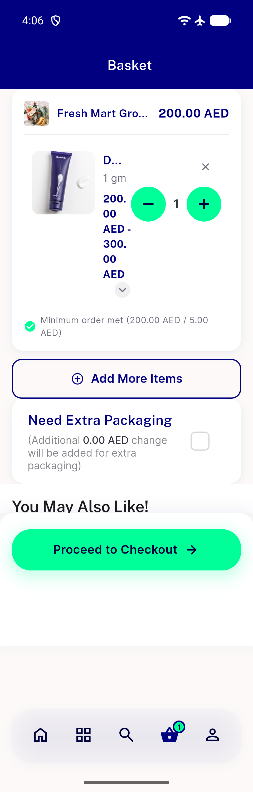</a> ac1 en 320dp cart</td>
<td align="center" width="33%"><a href="ac2-ar-320dp-cart.png">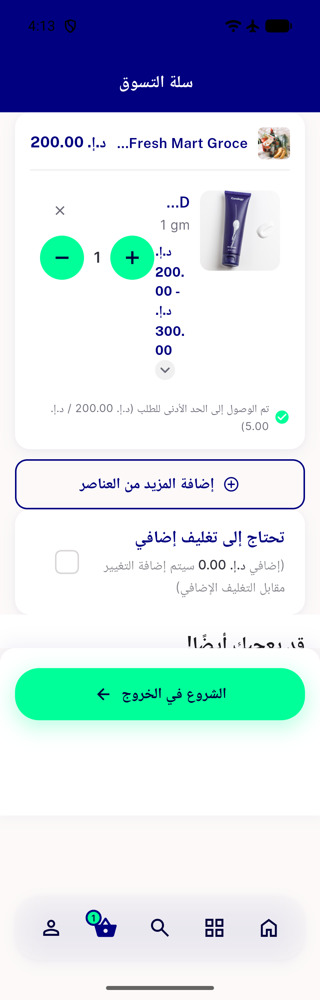</a> ac2 ar 320dp cart</td>
<td align="center" width="33%"> ac3 ar 390dp cart</td>
</tr>
<tr>
<td align="center" width="33%"><a href="ac3-en-390dp-cart.png">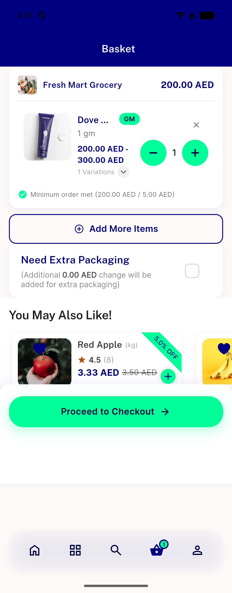</a> ac3 en 390dp cart</td>
<td align="center" width="33%"><a href="ac4b-en-320dp-scale1.3-qty10.png">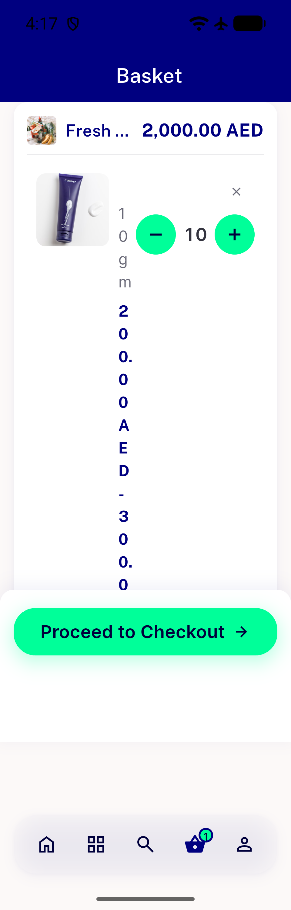</a> ac4b en 320dp scale1.3 qty10</td>
<td align="center" width="33%"> bug toggle row blank 320dp ar</td>
</tr>
<tr>
<td align="center" width="33%"> bug toggle row blank 320dp en</td>
<td align="center" width="33%"><a href="crop-cart-item-top.png">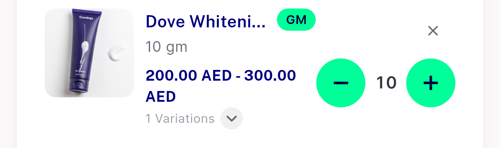</a> crop cart item top</td>
<td align="center" width="33%"><a href="cycle1-ac1-en-320dp-reconfirm.png">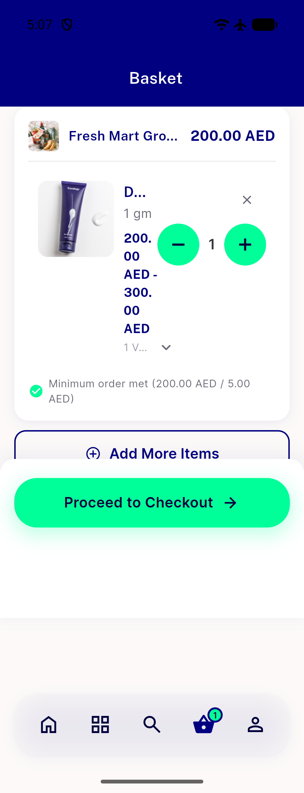</a> cycle1 ac1 en 320dp reconfirm</td>
</tr>
<tr>
<td align="center" width="33%"> cycle1 ac2 ar 320dp postupdate</td>
<td align="center" width="33%"><a href="cycle1-ac2-en-320dp-cart.png">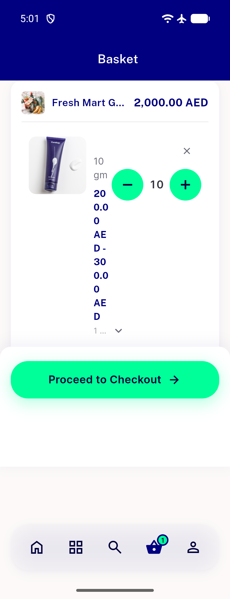</a> cycle1 ac2 en 320dp cart</td>
<td align="center" width="33%"><a href="cycle1-ac2-en-320dp-postupdate.png">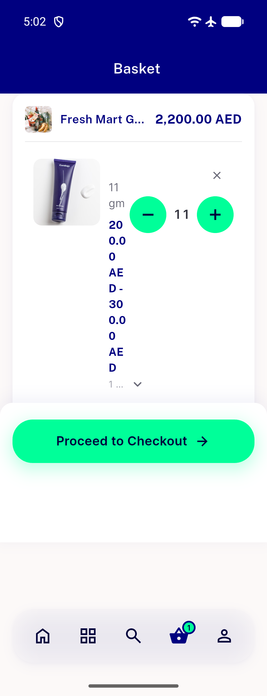</a> cycle1 ac2 en 320dp postupdate</td>
</tr>
<tr>
<td align="center" width="33%"> cycle1 ac3 ar 390dp reconfirm</td>
<td align="center" width="33%"><a href="cycle1-ac3-en-390dp-reconfirm.png">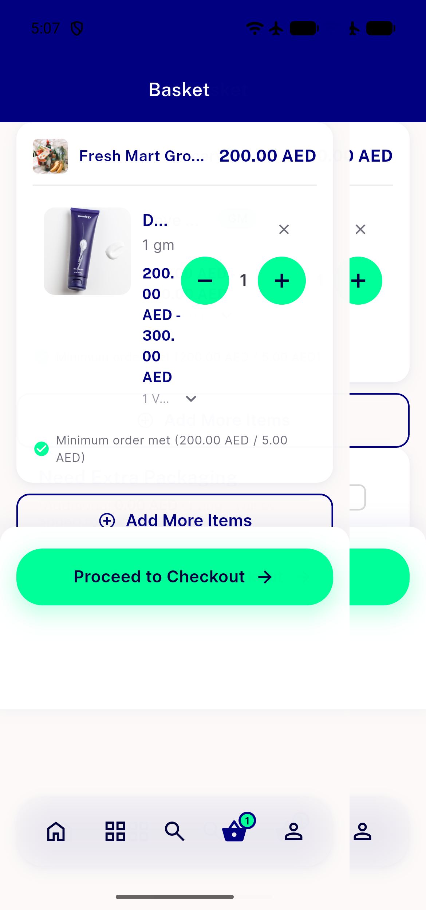</a> cycle1 ac3 en 390dp reconfirm</td>
<td align="center" width="33%"><a href="cycle1-ac3-en-390dp-reconfirm2.png">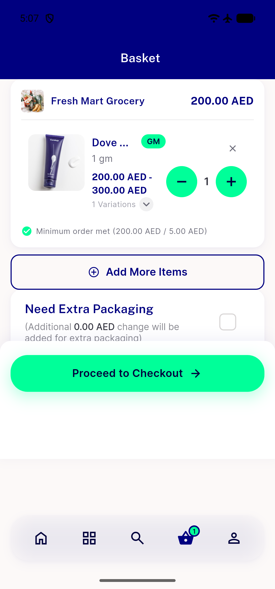</a> cycle1 ac3 en 390dp reconfirm2</td>
</tr>
<tr>
<td align="center" width="33%"><a href="cycle1-halal-regcandidate-320dp-1.3x-v2.png">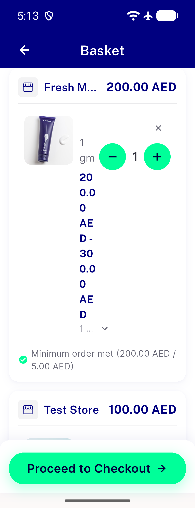</a> cycle1 halal regcandidate 320dp 1.3x v2</td>
<td align="center" width="33%"><a href="cycle1-halal-regcandidate-320dp-1.3x-v3.png">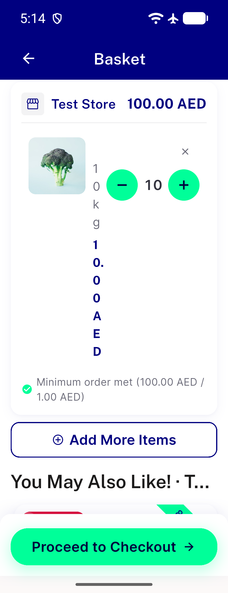</a> cycle1 halal regcandidate 320dp 1.3x v3</td>
<td align="center" width="33%"><a href="cycle1-halal-regcandidate-320dp-1.3x.png">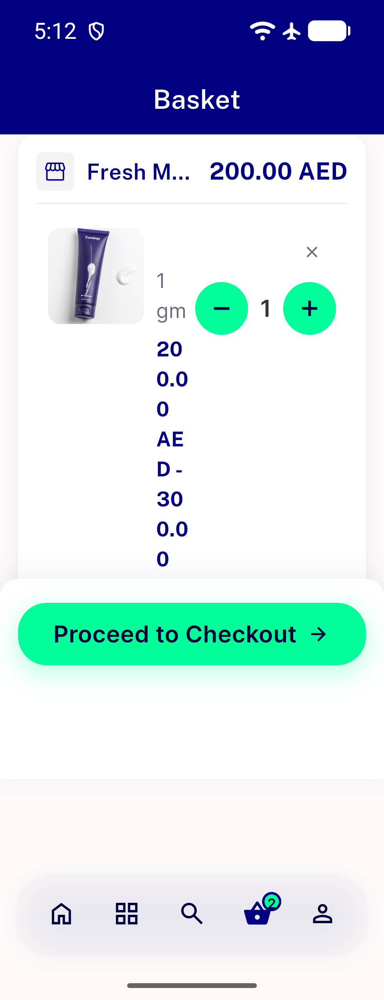</a> cycle1 halal regcandidate 320dp 1.3x</td>
</tr>
<tr>
<td align="center" width="33%"><a href="cycle1-halal-regcandidate-390dp-1.3x-v2.png">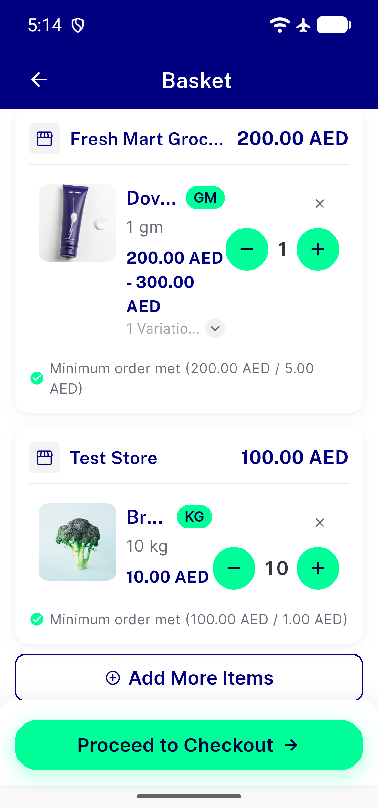</a> cycle1 halal regcandidate 390dp 1.3x v2</td>
<td align="center" width="33%"><a href="cycle1-halal-regcandidate-390dp-1.3x.png">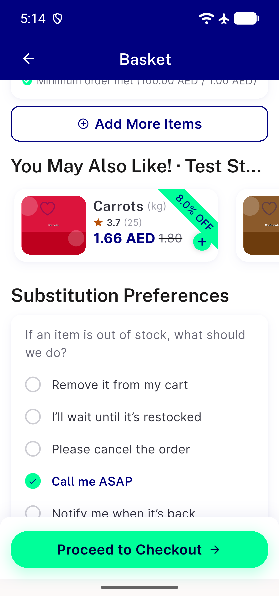</a> cycle1 halal regcandidate 390dp 1.3x</td>
<td align="center" width="33%"> find remove x</td>
</tr>
</table>

### Other artifacts
- [`bug-toggle-row-collapse-320dp.log`](bug-toggle-row-collapse-320dp.log)

---
*From `nears/docs/qa-evidence/NEARS-2723/` · public-repo scrub policy (no live secrets; verified clean).*
