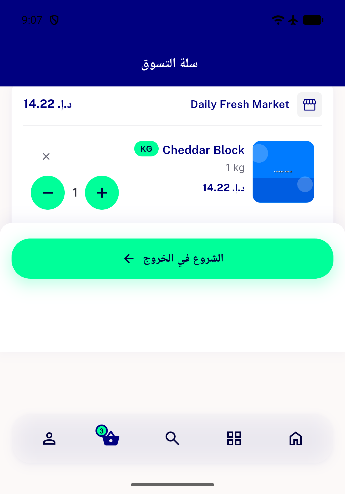
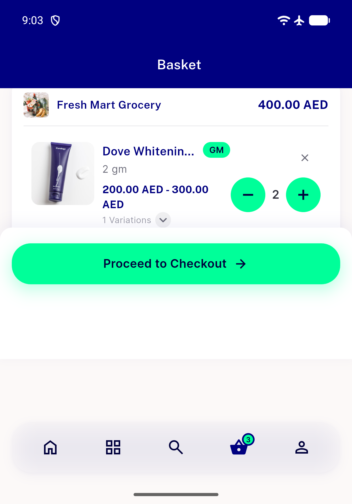
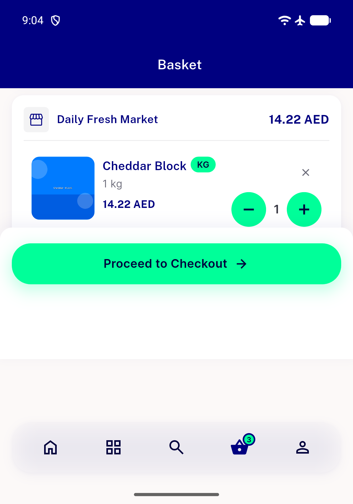
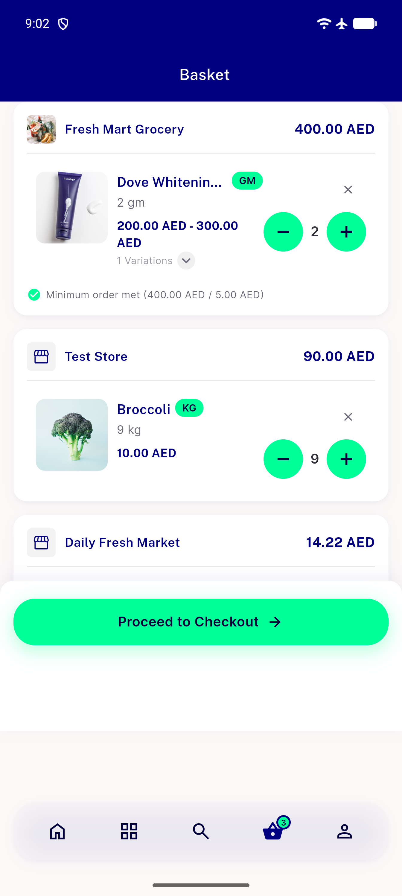

# QA Evidence — NEARS-2726

**PASS — 640dp/EN+AR item reachability + zero overflow confirmed live (emulator-5556); 213/213 automated cart tests green**

**6 screenshot(s).** Click any thumbnail for full resolution.

<table>
<tr>
<td align="center" width="33%"> ac1 ac2 640dp ar last item reached</td>
<td align="center" width="33%"> ac1 ac2 640dp en initial</td>
<td align="center" width="33%"> ac1 ac2 640dp en last item reached</td>
</tr>
<tr>
<td align="center" width="33%"> ac3 standard height ar</td>
<td align="center" width="33%"> ac3 standard height en</td>
<td align="center" width="33%"> ac3 standard height scrolled en</td>
</tr>
</table>

---
*From `nears/docs/qa-evidence/NEARS-2726/` · public-repo scrub policy (no live secrets; verified clean).*
