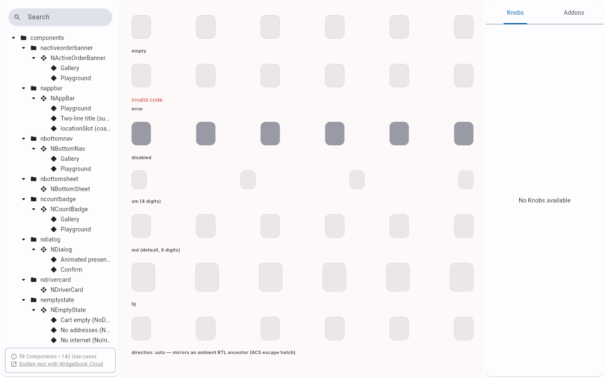
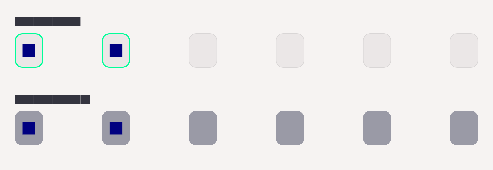

# QA Evidence — NEARS-2729

**cycle1 re-QA: PASS - AC1 disabled-color pixel-verified #9A9AA6 (textFaint), automated backstop 20/20 green**

**2 screenshot(s).** Click any thumbnail for full resolution.

<table>
<tr>
<td align="center" width="33%"> ac1 otp disabled gallery</td>
<td align="center" width="33%"> notpinput disabled vs enabled</td>
</tr>
</table>

### Other artifacts
- [`ac1-otp-disabled-gallery-a11y.xml`](ac1-otp-disabled-gallery-a11y.xml)

---
*From `nears/docs/qa-evidence/NEARS-2729/` · public-repo scrub policy (no live secrets; verified clean).*
