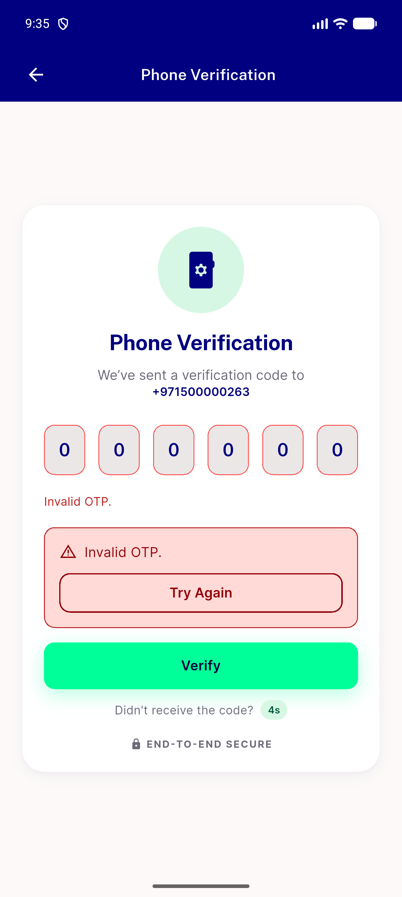
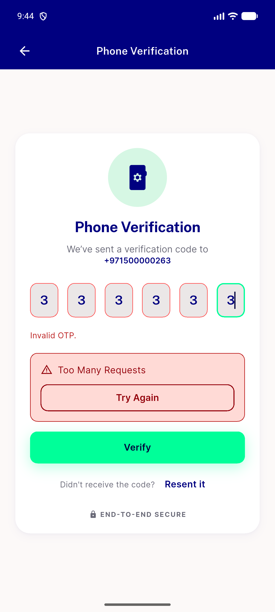

# QA Evidence — NEARS-2730

**PASS — verifyToken + forgetPassword now surface real backend error messages inline; regression: pre-existing errorController disposal race (unrelated to this diff)**

**2 screenshot(s).** Click any thumbnail for full resolution.

<table>
<tr>
<td align="center" width="33%"> ac1 invalid otp inline error</td>
<td align="center" width="33%"> ac2 resend inline error</td>
</tr>
</table>

### Other artifacts
- [`ac3-curl-verify-token-invalid.log`](ac3-curl-verify-token-invalid.log)
- [`bug-verifytoken-uncaught-async-error.log`](bug-verifytoken-uncaught-async-error.log)

---
*From `nears/docs/qa-evidence/NEARS-2730/` · public-repo scrub policy (no live secrets; verified clean).*
