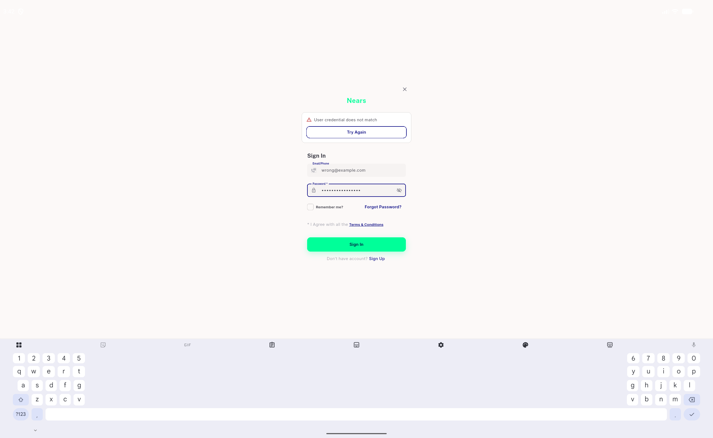
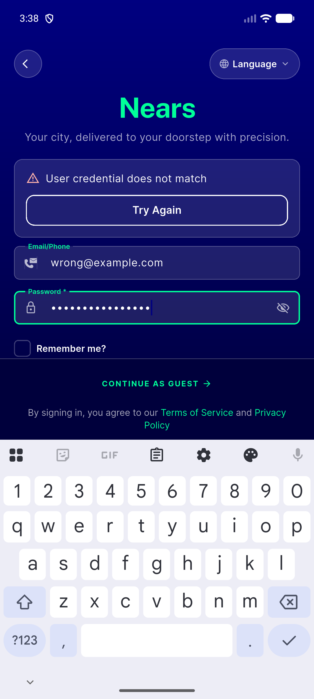
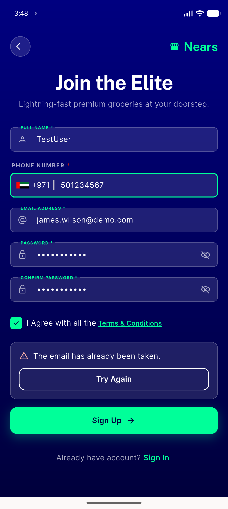
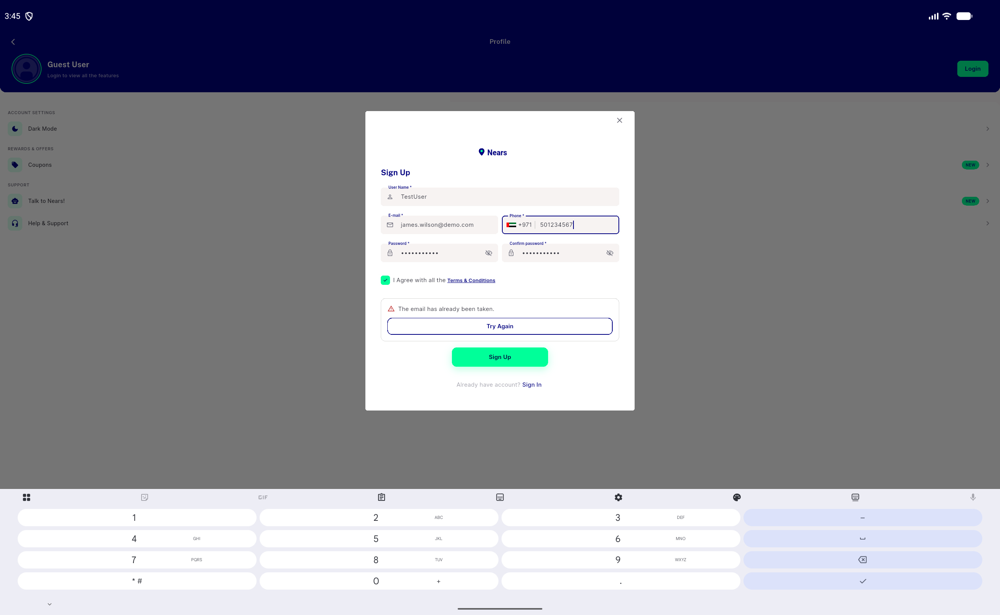
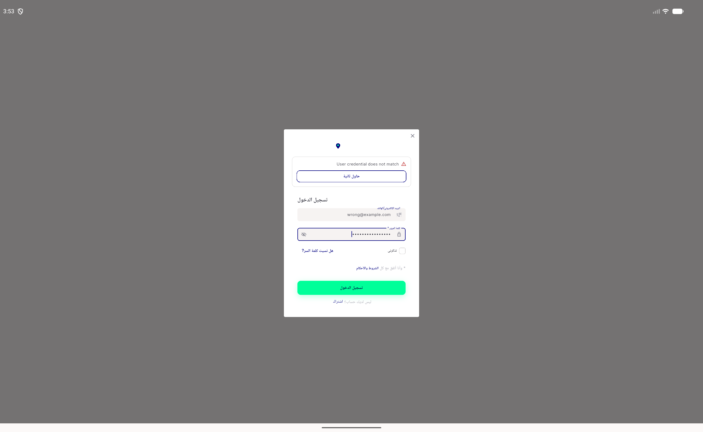
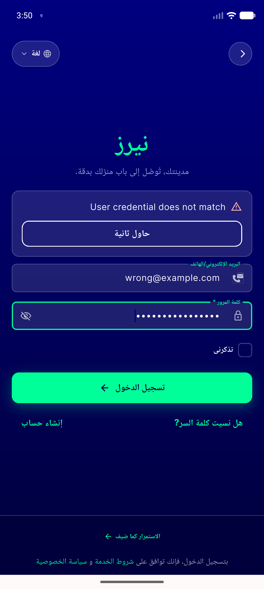
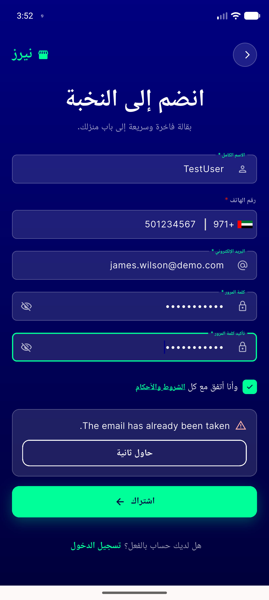

# QA Evidence — NEARS-2731

**PASS — NErrorPanel migration verified live (sign-in x3 hosts, sign-up mobile+desktop, RTL, contrast, retry regression)**

**8 screenshot(s).** Click any thumbnail for full resolution.

<table>
<tr>
<td align="center" width="33%"> ac1 authdialogwidget error neutral light</td>
<td align="center" width="33%"> ac1 desktop card error neutral light</td>
<td align="center" width="33%"> ac1 navy hero signin error verbatim</td>
</tr>
<tr>
<td align="center" width="33%"> ac2 mobile signup error navy</td>
<td align="center" width="33%"> ac4 desktop signup unaffected</td>
<td align="center" width="33%"> ac5 rtl desktop card error</td>
</tr>
<tr>
<td align="center" width="33%"> ac5 rtl signin navy error</td>
<td align="center" width="33%"> ac5 rtl signup navy error</td>
</tr>
</table>

---
*From `nears/docs/qa-evidence/NEARS-2731/` · public-repo scrub policy (no live secrets; verified clean).*
