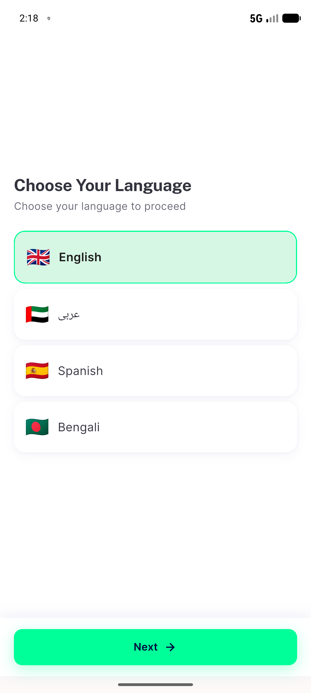

# QA Evidence — NEARS-2734

**PASS - broken SVG dedupe fix verified live, no UncaughtAsyncError duplicate**

**1 screenshot(s).** Click any thumbnail for full resolution.

<table>
<tr>
<td align="center" width="33%"> ac1 broken svg language screen</td>
</tr>
</table>

### Other artifacts
- [`ac1-log-excerpt.log`](ac1-log-excerpt.log)

---
*From `nears/docs/qa-evidence/NEARS-2734/` · public-repo scrub policy (no live secrets; verified clean).*
