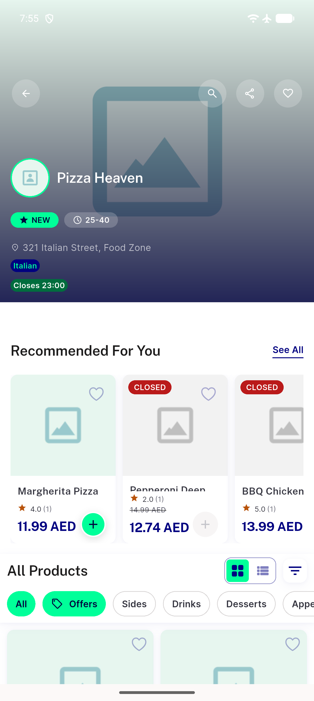
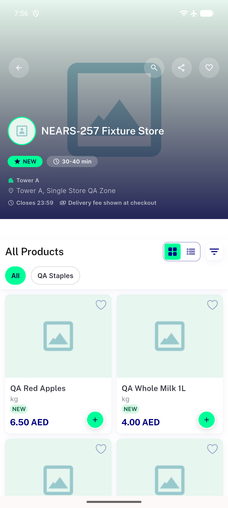

# QA Evidence — NEARS-2739

**PASS - distance-api WALK->DRIVE retry fix verified live (Pizza Heaven honest fallback + WARN, Fixture Store real ~126km distance, Morning Mart no-regression)**

**2 screenshot(s).** Click any thumbnail for full resolution.

<table>
<tr>
<td align="center" width="33%"> ac2 pizzaheaven crosszone fallback</td>
<td align="center" width="33%"> ac3 fixturestore realdistance</td>
</tr>
</table>

### Other artifacts
- [`ac1-ac2-pizzaheaven-correlation.log`](ac1-ac2-pizzaheaven-correlation.log)
- [`ac3-fixturestore-correlation.log`](ac3-fixturestore-correlation.log)
- [`ac4-morningmart-noregression.log`](ac4-morningmart-noregression.log)

---
*From `nears/docs/qa-evidence/NEARS-2739/` · public-repo scrub policy (no live secrets; verified clean).*
