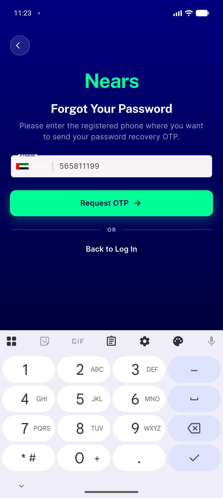
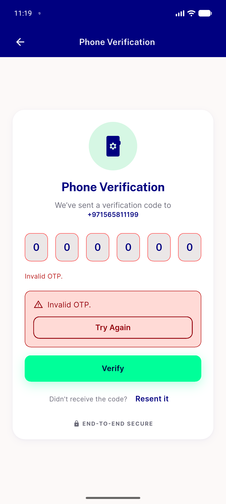

# QA Evidence — NEARS-2743

**PASS - AC1 no uncaught StateError on late verify-token failure after Back (delay-proxy race repro + pinned widget test, RED pre-fix/GREEN post-fix); AC2 mounted-case shake+panel byte-identical**

**2 screenshot(s).** Click any thumbnail for full resolution.

<table>
<tr>
<td align="center" width="33%"> ac1 post race app alive</td>
<td align="center" width="33%"> ac2 mounted error panel</td>
</tr>
</table>

### Other artifacts
- [`ac1-delay-proxy.log`](ac1-delay-proxy.log)
- [`ac1-race-full-logcat.log`](ac1-race-full-logcat.log)

---
*From `nears/docs/qa-evidence/NEARS-2743/` · public-repo scrub policy (no live secrets; verified clean).*
