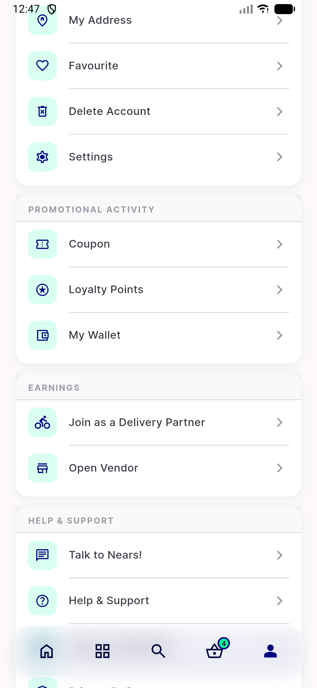
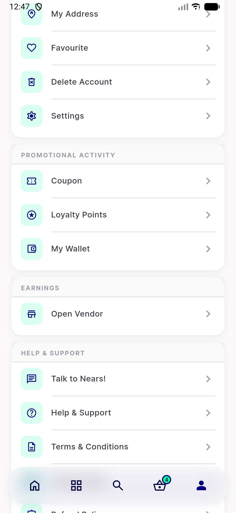
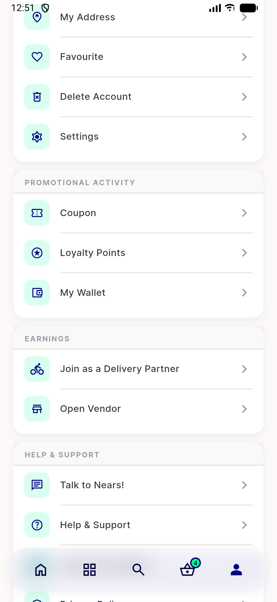

# QA Evidence — NEARS-2747

**PASS -- UserApp emulator-5562, all 3 ACs demonstrated live + module-preserve regression + fail-soft offline + storeReg spot-check**

**3 screenshot(s).** Click any thumbnail for full resolution.

<table>
<tr>
<td align="center" width="33%"> ac1 row visible after live toggle</td>
<td align="center" width="33%"> ac2 row absent live toggle</td>
<td align="center" width="33%"> ac3 cold start row visible</td>
</tr>
</table>

---
*From `nears/docs/qa-evidence/NEARS-2747/` · public-repo scrub policy (no live secrets; verified clean).*
