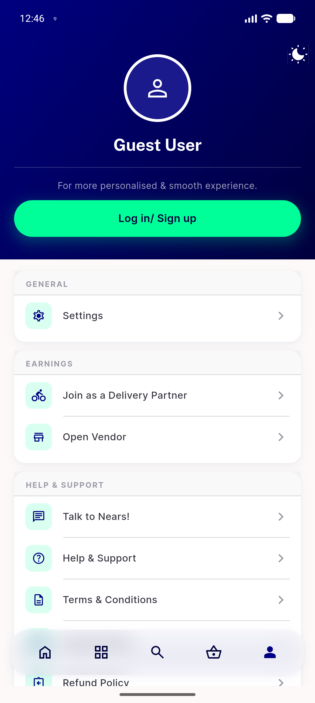
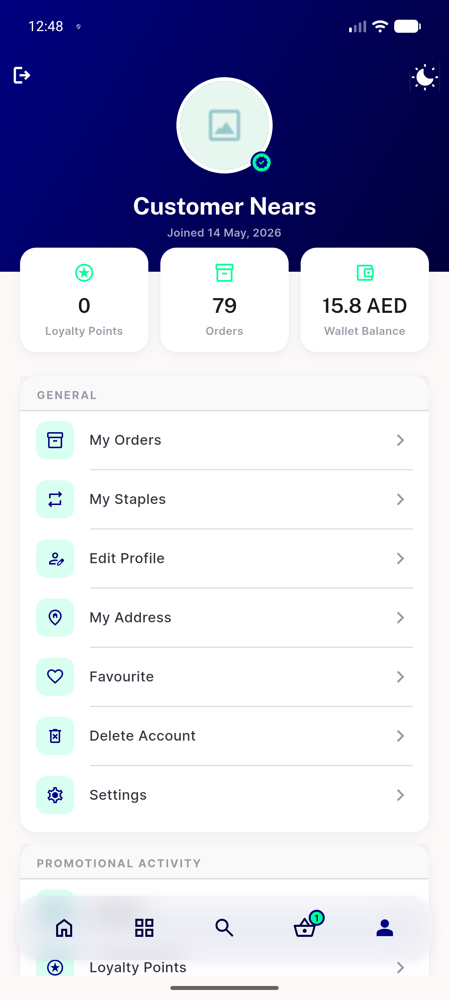
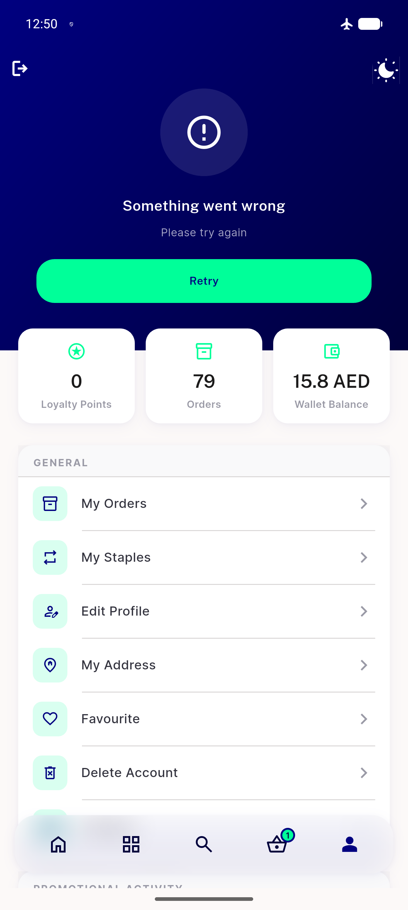
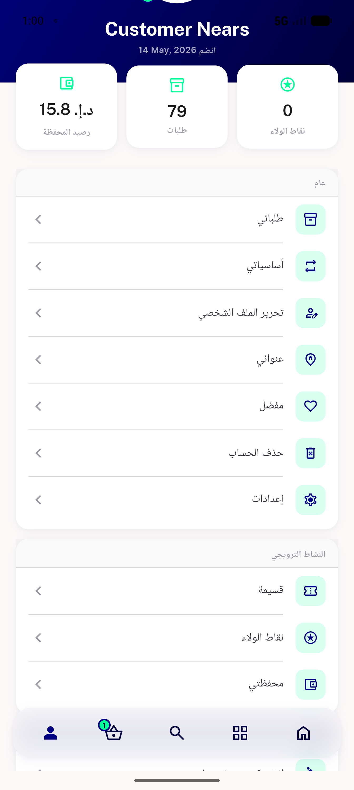
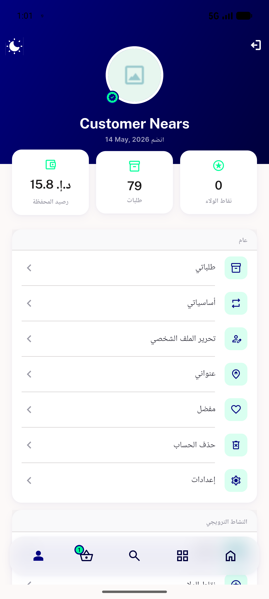
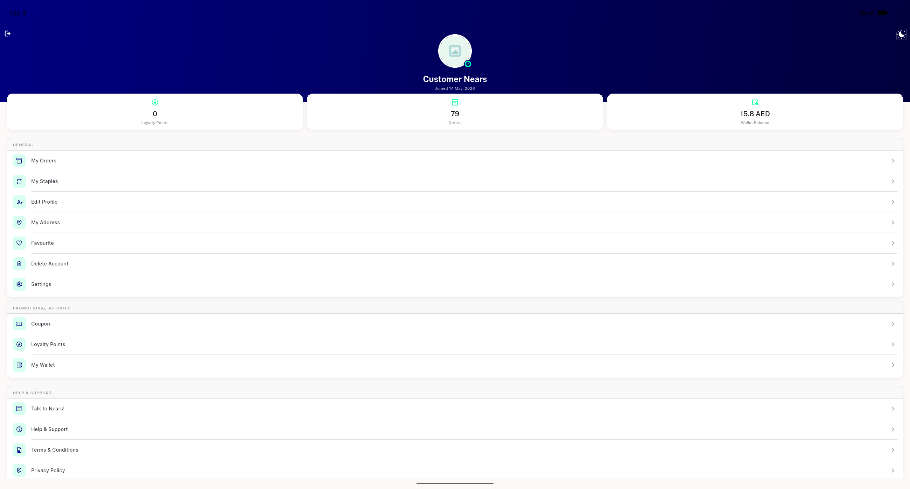

# QA Evidence — NEARS-2750

**PASS — Profile tab (menu_screen) reskin, DLS tokens verified, AC2 error/retry confirmed on-device**

**6 screenshot(s).** Click any thumbnail for full resolution.

<table>
<tr>
<td align="center" width="33%"> guest hero</td>
<td align="center" width="33%"> signedin hero</td>
<td align="center" width="33%"> error retry state</td>
</tr>
<tr>
<td align="center" width="33%"> rtl arabic</td>
<td align="center" width="33%"> 04b rtl top</td>
<td align="center" width="33%"> desktop signedin</td>
</tr>
</table>

---
*From `nears/docs/qa-evidence/NEARS-2750/` · public-repo scrub policy (no live secrets; verified clean).*
