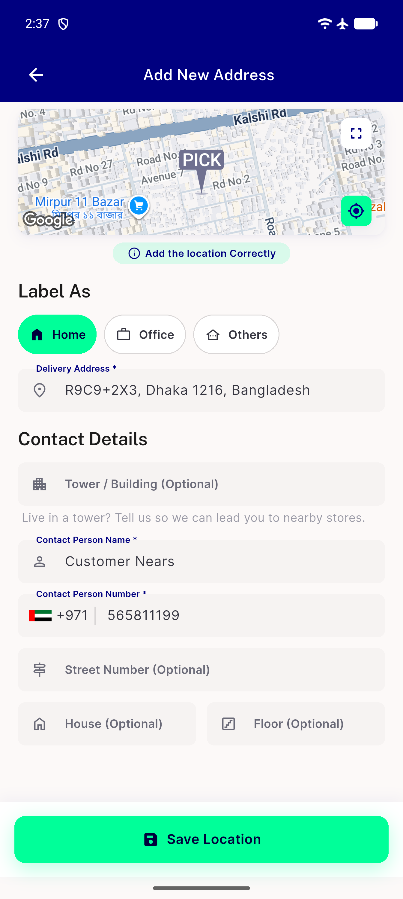
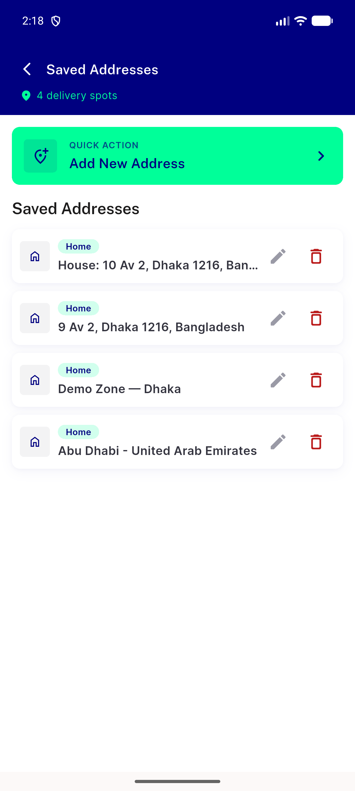
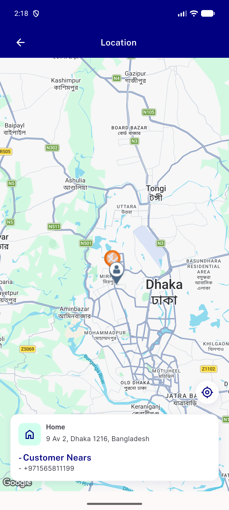
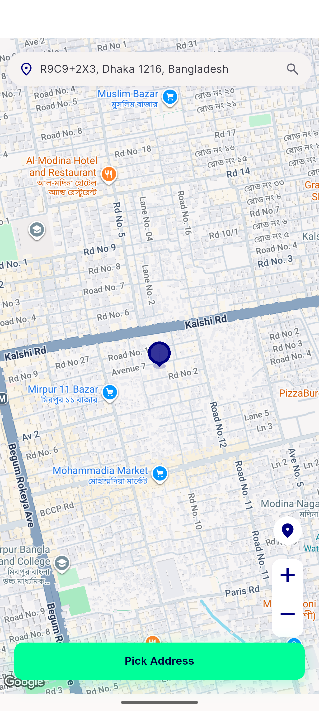

# QA Evidence — NEARS-2751

**QA PASS — Address Management (map/pick_map/address/add_address) reskin verified live**

**4 screenshot(s).** Click any thumbnail for full resolution.

<table>
<tr>
<td align="center" width="33%"> add address screen</td>
<td align="center" width="33%"> address screen success</td>
<td align="center" width="33%"> map screen loaded</td>
</tr>
<tr>
<td align="center" width="33%"> pick map screen</td>
</tr>
</table>

### Other artifacts
- [`bug-address-list-timeout-fail-log.log`](bug-address-list-timeout-fail-log.log)
- [`bug-profile-infinite-spinner-blocks-address-entry.log`](bug-profile-infinite-spinner-blocks-address-entry.log)

---
*From `nears/docs/qa-evidence/NEARS-2751/` · public-repo scrub policy (no live secrets; verified clean).*
