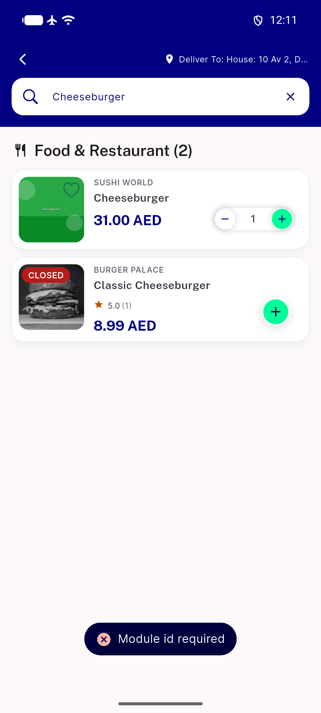

# QA Evidence — NEARS-2753

**Cycle 2 delta re-QA: FAIL -- remove-item DELETE now returns 200 (AC2 holds) but a NEW uncaught null-check crash in ItemController.setExistInCart is newly reachable via this ticket's own success path**

**6 screenshot(s).** Click any thumbnail for full resolution.

<table>
<tr>
<td align="center" width="33%"> after remove search results toast</td>
<td align="center" width="33%"> before remove search results</td>
<td align="center" width="33%"> bug cart remove item still 400</td>
</tr>
<tr>
<td align="center" width="33%"> bug raw backend toast guest session</td>
<td align="center" width="33%"> bug search results quick remove still qty1</td>
<td align="center" width="33%"> regression pass in cart screen remove works</td>
</tr>
</table>

### Other artifacts
- [`bug-cart-remove-item-still-400.log`](bug-cart-remove-item-still-400.log)
- [`bug-cycle2-setexistincart-nullcheck-crash.log`](bug-cycle2-setexistincart-nullcheck-crash.log)
- [`bug-raw-error-toast-dump.xml`](bug-raw-error-toast-dump.xml)
- [`regression-clear-cart-400.log`](regression-clear-cart-400.log)

---
*From `nears/docs/qa-evidence/NEARS-2753/` · public-repo scrub policy (no live secrets; verified clean).*
