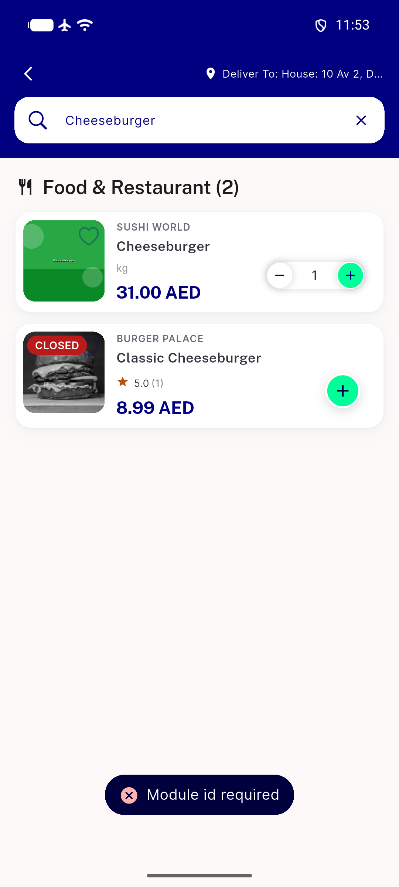
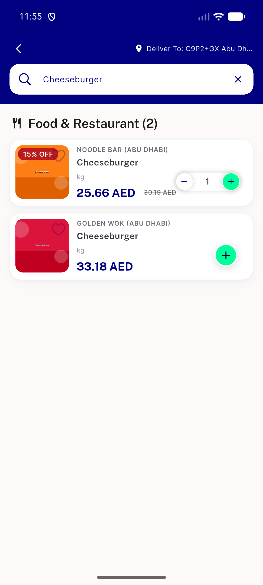
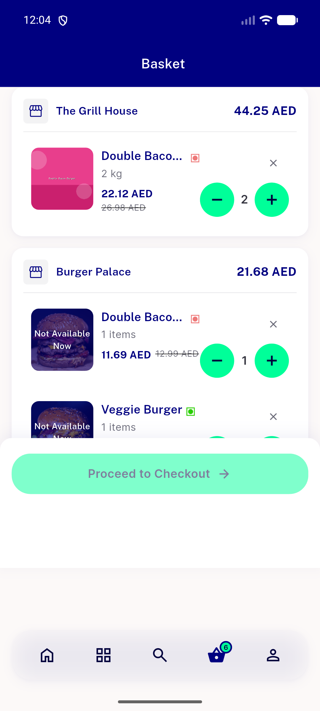
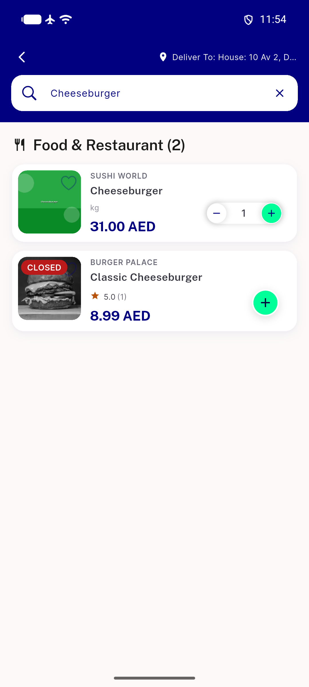

# QA Evidence — NEARS-2753

**FAIL: cart/remove-item still 400s Module id required in the cross-module-search-null-module repro**

**7 screenshot(s).** Click any thumbnail for full resolution.

<table>
<tr>
<td align="center" width="33%"> after remove search results toast</td>
<td align="center" width="33%"> before remove search results</td>
<td align="center" width="33%"> bug cart remove item still 400</td>
</tr>
<tr>
<td align="center" width="33%"> bug search results quick remove still qty1</td>
<td align="center" width="33%"> regression pass in cart screen remove works</td>
<td align="center" width="33%"> toast immediate</td>
</tr>
<tr>
<td align="center" width="33%"> toast immediate2</td>
</tr>
</table>

### Other artifacts
- [`bug-cart-remove-item-still-400.log`](bug-cart-remove-item-still-400.log)
- [`bug-raw-error-toast-dump.xml`](bug-raw-error-toast-dump.xml)
- [`regression-clear-cart-400.log`](regression-clear-cart-400.log)

---
*From `nears/docs/qa-evidence/NEARS-2753/` · public-repo scrub policy (no live secrets; verified clean).*
