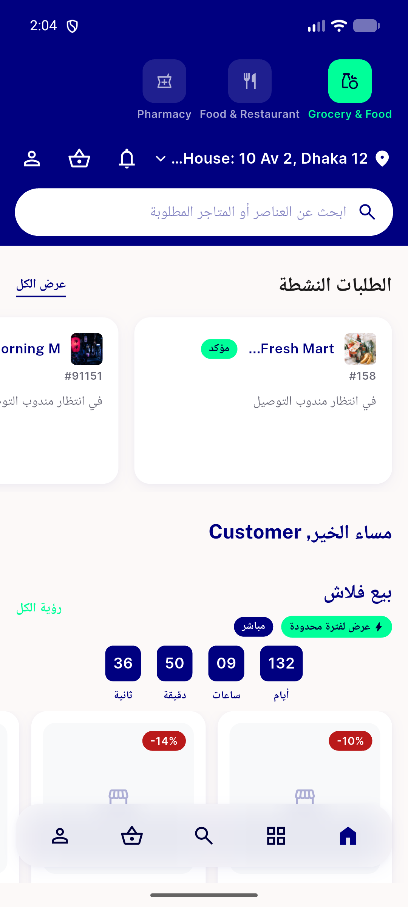
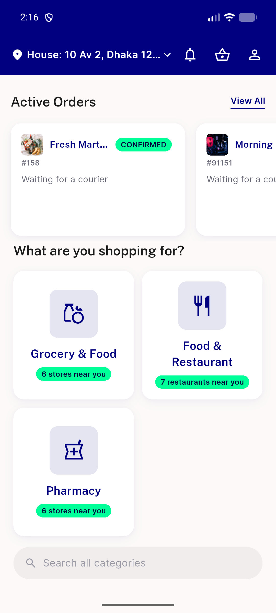

# QA Evidence — NEARS-2756

**QA-lite AC1+AC2 PASS — order status card renders cleanly, no overflow, AR+EN both verified**

**2 screenshot(s).** Click any thumbnail for full resolution.

<table>
<tr>
<td align="center" width="33%"> ac1 home ar order status card</td>
<td align="center" width="33%"> ac2 home en order status card</td>
</tr>
</table>

---
*From `nears/docs/qa-evidence/NEARS-2756/` · public-repo scrub policy (no live secrets; verified clean).*
