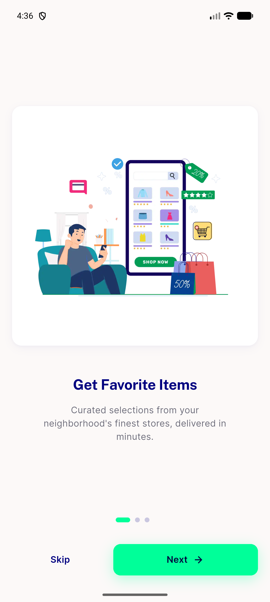
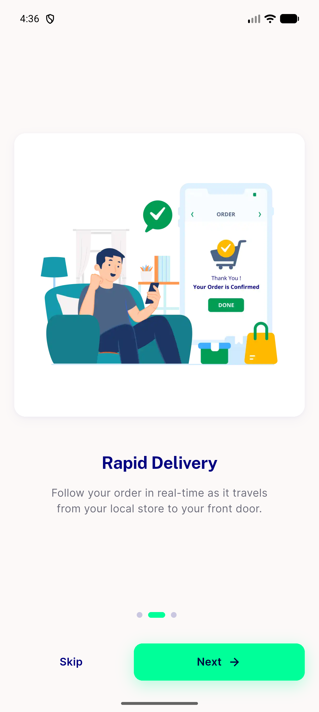
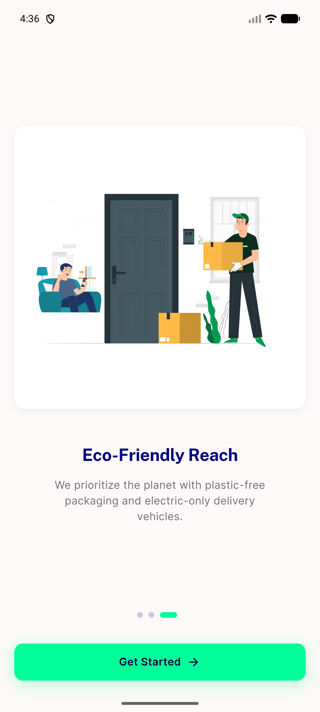
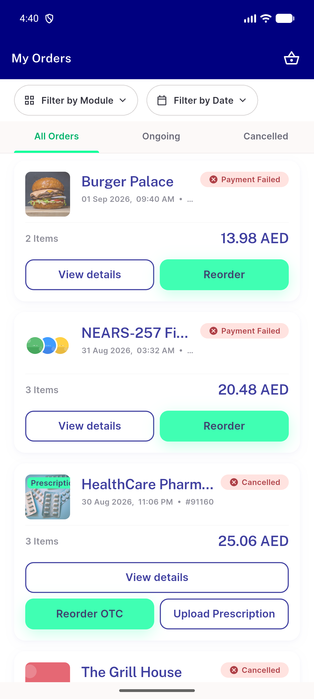
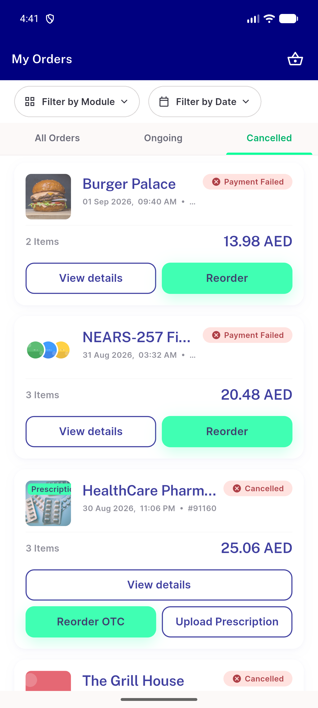
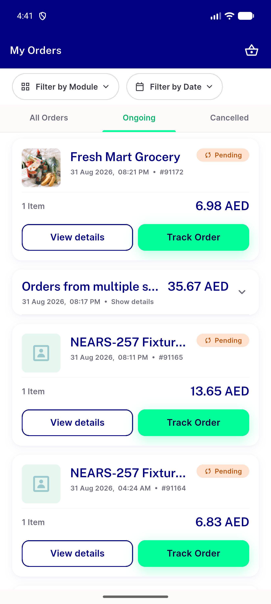

# QA Evidence — NEARS-2758

**PASS - AC-B1..B4 demonstrated live, emulator-5556, UserApp d2a59207d**

**6 screenshot(s).** Click any thumbnail for full resolution.

<table>
<tr>
<td align="center" width="33%"> onboarding step1</td>
<td align="center" width="33%"> onboarding step2</td>
<td align="center" width="33%"> onboarding step3</td>
</tr>
<tr>
<td align="center" width="33%"> order screen tab all</td>
<td align="center" width="33%"> order screen tab cancelled</td>
<td align="center" width="33%"> order screen tab ongoing</td>
</tr>
</table>

---
*From `nears/docs/qa-evidence/NEARS-2758/` · public-repo scrub policy (no live secrets; verified clean).*
