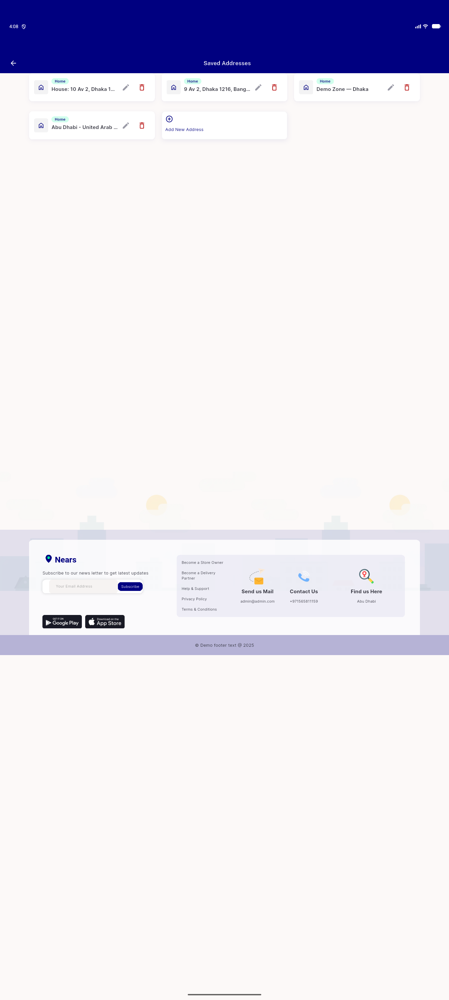
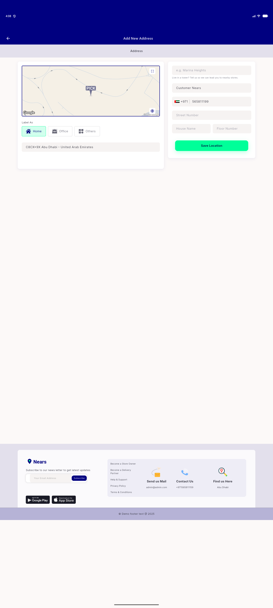
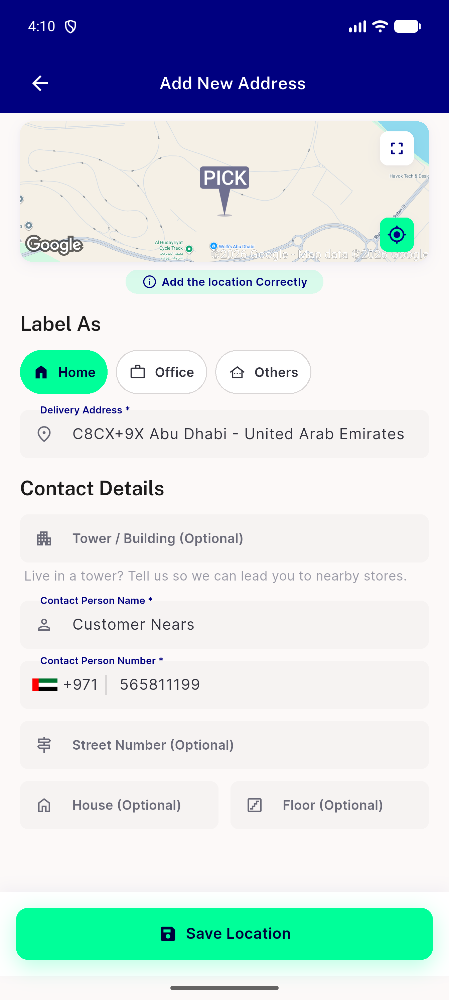
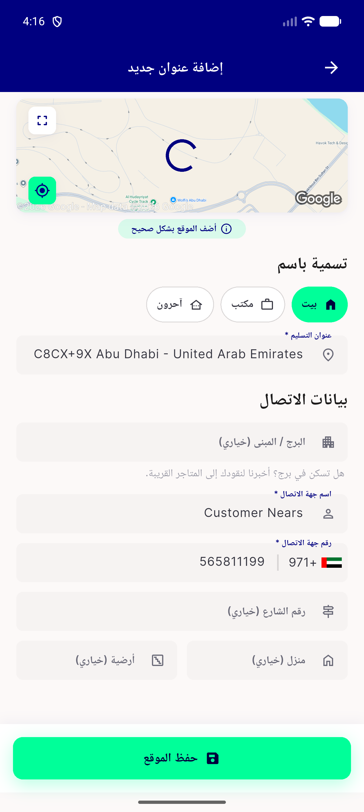
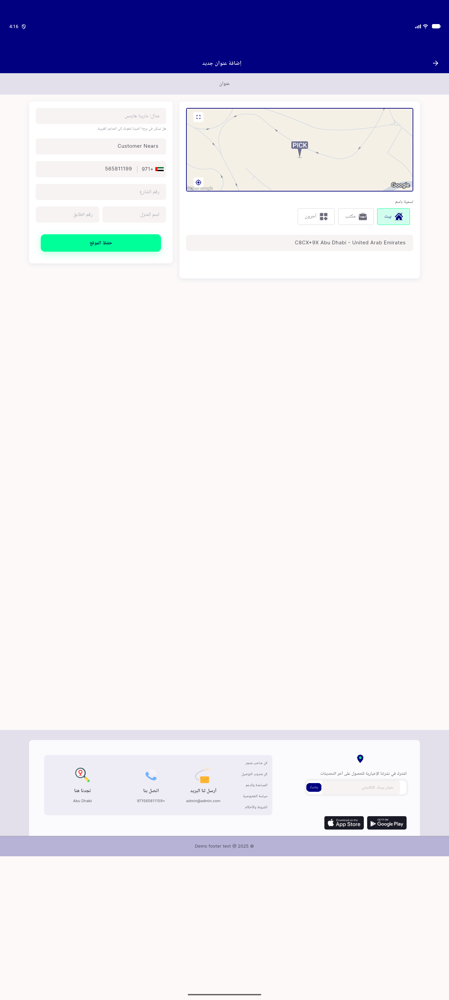

# QA Evidence — NEARS-2759

**PASS — 10/10 raw Icon()/Text() sites migrated to NIcon/NText, visual parity confirmed live LTR+RTL desktop+mobile, AC3 navy-via-NIcon-prop confirmed; 2 pre-existing unrelated regressions found+isolated (menu_hero_load_error_test, dls_golden_test CI light/dark), zero task_bugs**

**6 screenshot(s).** Click any thumbnail for full resolution.

<table>
<tr>
<td align="center" width="33%"> address screen desktop</td>
<td align="center" width="33%"> add address desktop</td>
<td align="center" width="33%"> add address mobile</td>
</tr>
<tr>
<td align="center" width="33%"> address screen mobile rtl</td>
<td align="center" width="33%"> add address mobile rtl</td>
<td align="center" width="33%"> add address desktop rtl</td>
</tr>
</table>

### Other artifacts
- [`bug-dls-golden-ci-preexisting.log`](bug-dls-golden-ci-preexisting.log)
- [`bug-menu-hero-load-error-onnavy.log`](bug-menu-hero-load-error-onnavy.log)

---
*From `nears/docs/qa-evidence/NEARS-2759/` · public-repo scrub policy (no live secrets; verified clean).*
