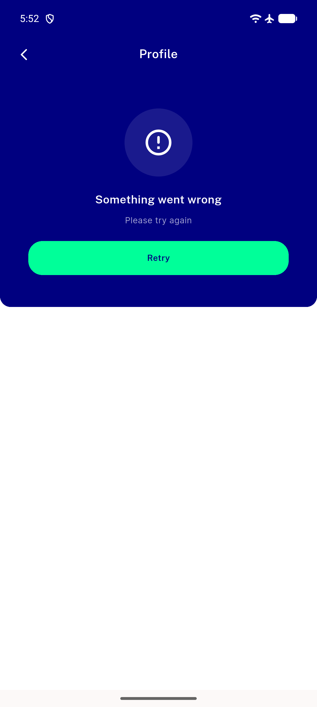
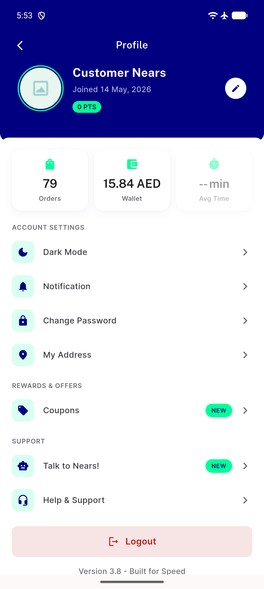

# QA Evidence — NEARS-2760

**delta re-QA fix-cycle 1 PASS AC2 hero growth**

**2 screenshot(s).** Click any thumbnail for full resolution.

<table>
<tr>
<td align="center" width="33%"> ac2 error content inside hero fixcycle3</td>
<td align="center" width="33%"> regression hero snapback after retry</td>
</tr>
</table>

---
*From `nears/docs/qa-evidence/NEARS-2760/` · public-repo scrub policy (no live secrets; verified clean).*
