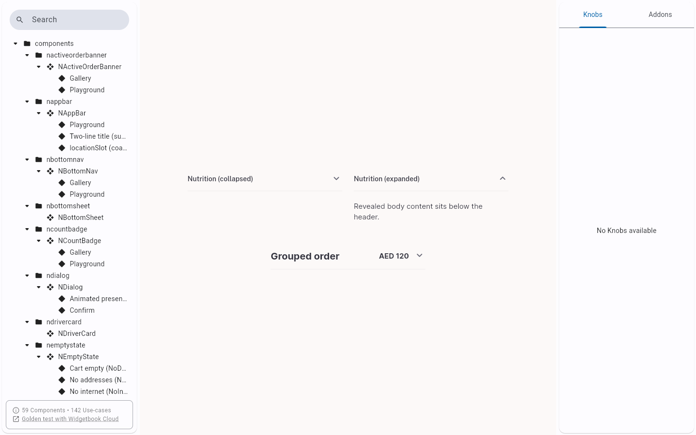
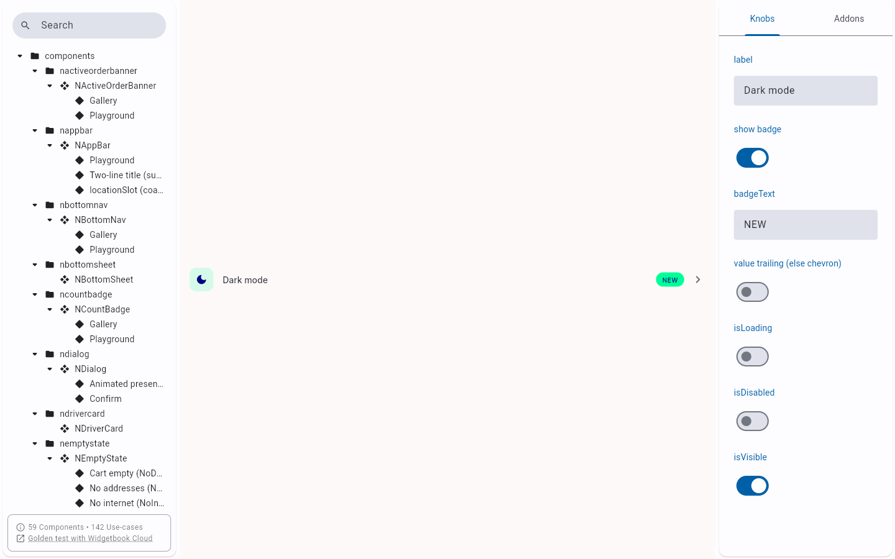
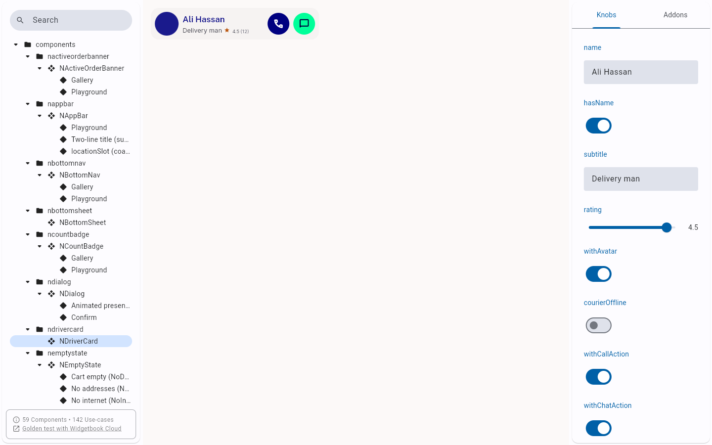

# QA Evidence — NEARS-2761

**PASS - icon disabledColor contrast fix (NAccordion/NSettingsTile/NDriverCard), light mode**

**3 screenshot(s).** Click any thumbnail for full resolution.

<table>
<tr>
<td align="center" width="33%"> ac1 naccordion gallery light</td>
<td align="center" width="33%"> ac2 nsettingstile playground light</td>
<td align="center" width="33%"> ac3 ndrivercard playground widgetbook toggle blocked</td>
</tr>
</table>

---
*From `nears/docs/qa-evidence/NEARS-2761/` · public-repo scrub policy (no live secrets; verified clean).*
