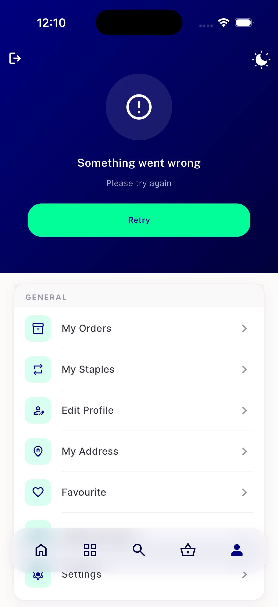

# QA Evidence — NEARS-2764

**PASS — NEARS-2764 verification-only: AC2/AC3 confirmed translucent-white-on-navy (textOnNavy/textOnNavyDim) on both the menu-hero and profile-screen error states, iPhone 17 Pro sim 53F3807C, feat/userapp-reskin2 HEAD (33e2a8567/951e752ca)**

**2 screenshot(s).** Click any thumbnail for full resolution.

<table>
<tr>
<td align="center" width="33%"> ac2 menu hero error navy</td>
<td align="center" width="33%"> ac3 profile screen error navy</td>
</tr>
</table>

### Other artifacts
- [`bug-route-helper-null-check-splash-data.log`](bug-route-helper-null-check-splash-data.log)

---
*From `nears/docs/qa-evidence/NEARS-2764/` · public-repo scrub policy (no live secrets; verified clean).*
