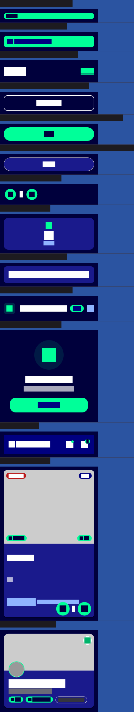
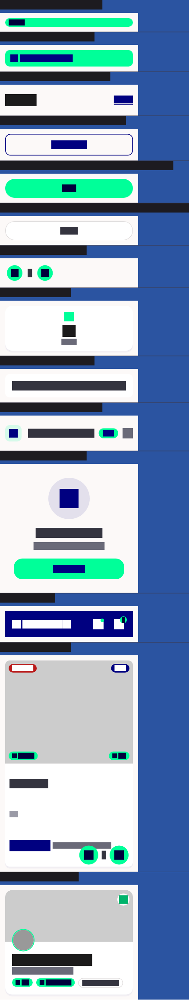

# QA Evidence — NEARS-2765

**PASS — DLS composite golden test (dls_golden_test.dart) passes clean 0% diff, both light+dark themes, pinned SDK 3.41.9. Root cause (4 already-shipped DLS changes: NEARS-1758/2761/2720/1924) documented in header comment. Goldens visually inspected — no defects.**

**2 screenshot(s).** Click any thumbnail for full resolution.

<table>
<tr>
<td align="center" width="33%"> dls dark accepted</td>
<td align="center" width="33%"> dls light accepted</td>
</tr>
</table>

---
*From `nears/docs/qa-evidence/NEARS-2765/` · public-repo scrub policy (no live secrets; verified clean).*
