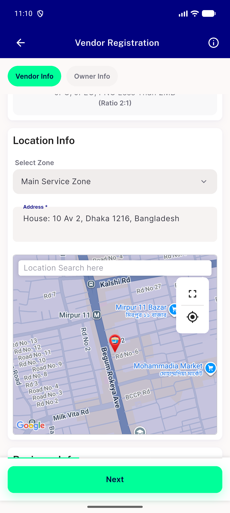
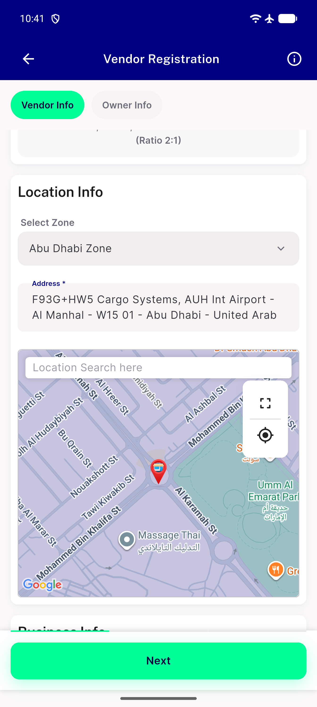

# QA Evidence — NEARS-2766

**PASS — AC2 re-verified clean, fix-cycle 1 (d3263af67)**

**2 screenshot(s).** Click any thumbnail for full resolution.

<table>
<tr>
<td align="center" width="33%"> ac2 post 12cycle loop clean</td>
<td align="center" width="33%"> app survives postcrash embedded card</td>
</tr>
</table>

### Other artifacts
- [`bug-zoom-getzoomlevel-unguarded-stateerror.log`](bug-zoom-getzoomlevel-unguarded-stateerror.log)
- [`progress.md`](progress.md)
- [`regression-search-dialog-locationcontroller-stateerror.log`](regression-search-dialog-locationcontroller-stateerror.log)

---
*From `nears/docs/qa-evidence/NEARS-2766/` · public-repo scrub policy (no live secrets; verified clean).*
