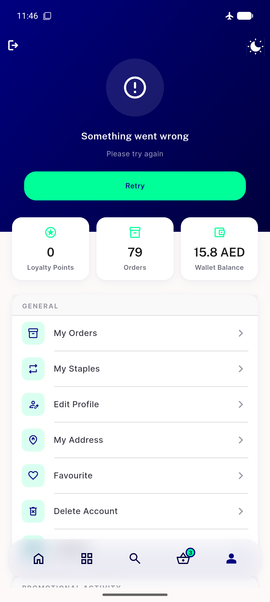

# QA Evidence — NEARS-2768

**PASS - Menu tab error-state subtitle legible on navy (textOnNavyDim), overlays/loaded state unaffected**

**1 screenshot(s).** Click any thumbnail for full resolution.

<table>
<tr>
<td align="center" width="33%"> ac1 menu error state</td>
</tr>
</table>

---
*From `nears/docs/qa-evidence/NEARS-2768/` · public-repo scrub policy (no live secrets; verified clean).*
