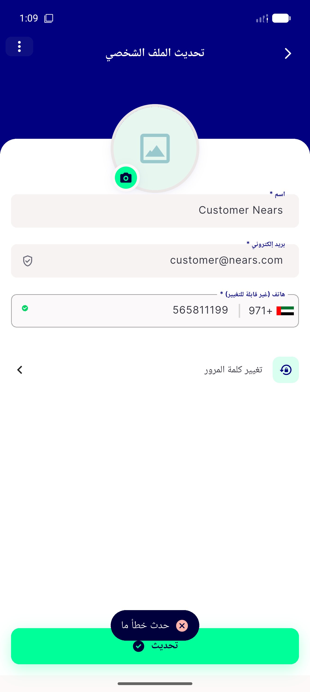
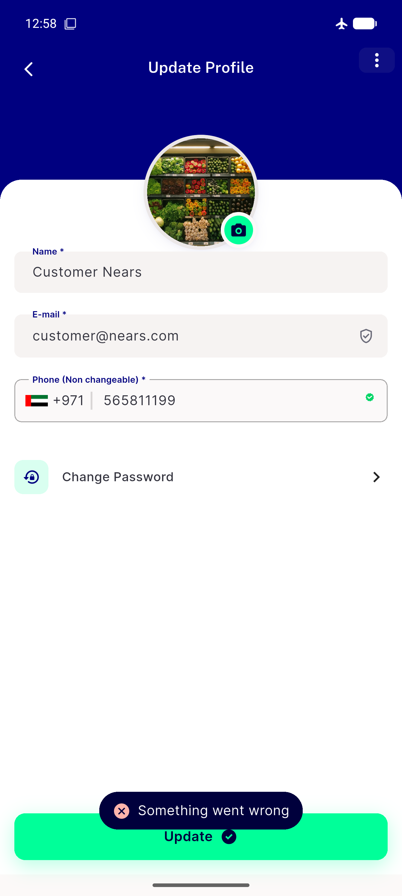
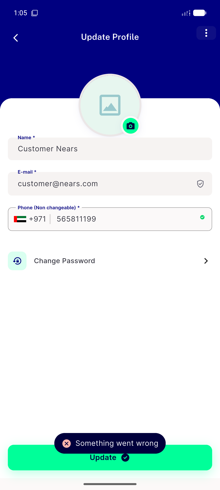

# QA Evidence — NEARS-2769

**PASS — AC1 exactly-one-toast + data-intact live-confirmed (English+Arabic); AC2 single AppLogger.failure confirmed via DEBUG logcat x4 triggers; automated backstop 72/72**

**3 screenshot(s).** Click any thumbnail for full resolution.

<table>
<tr>
<td align="center" width="33%"> ac1 arabic toast rtl</td>
<td align="center" width="33%"> ac1 core repro toast</td>
<td align="center" width="33%"> ac1 rapid retry no stack</td>
</tr>
</table>

---
*From `nears/docs/qa-evidence/NEARS-2769/` · public-repo scrub policy (no live secrets; verified clean).*
