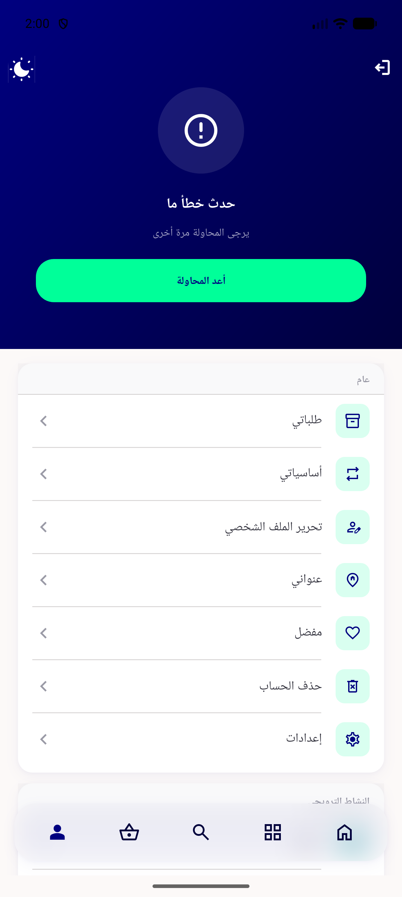
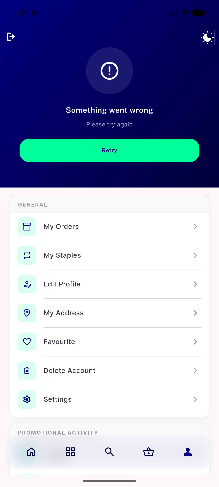
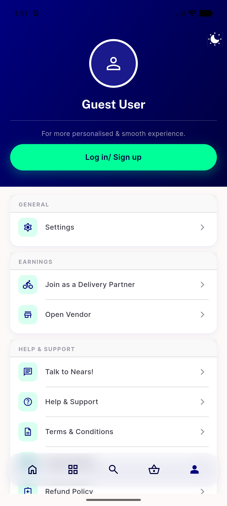
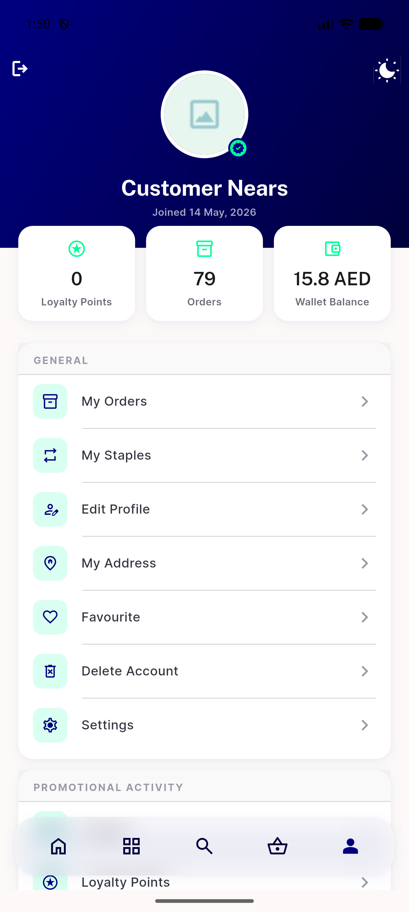
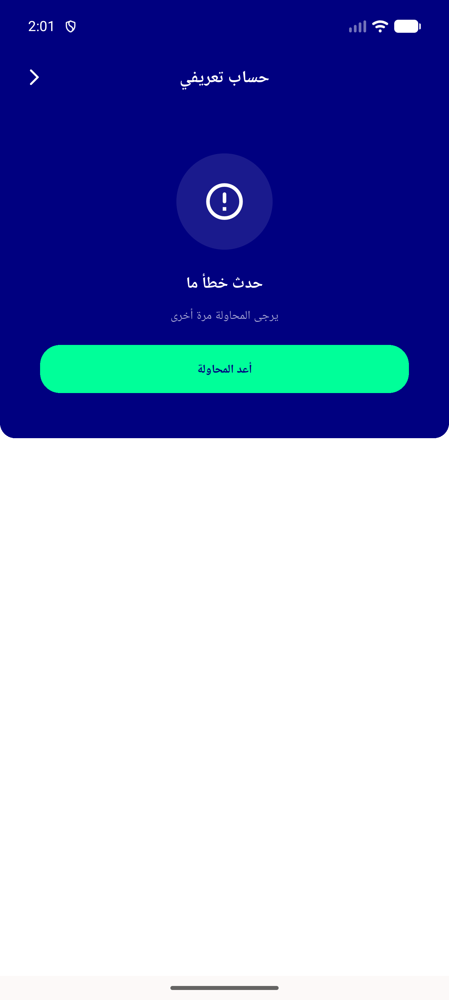
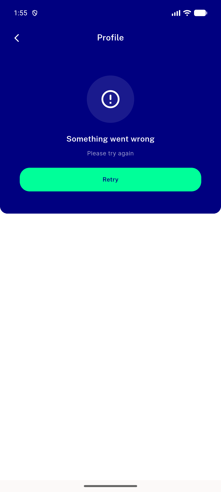
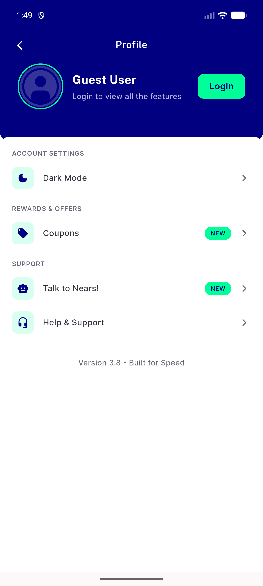
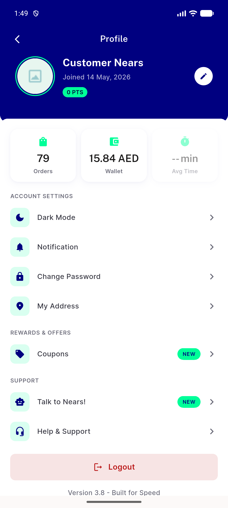
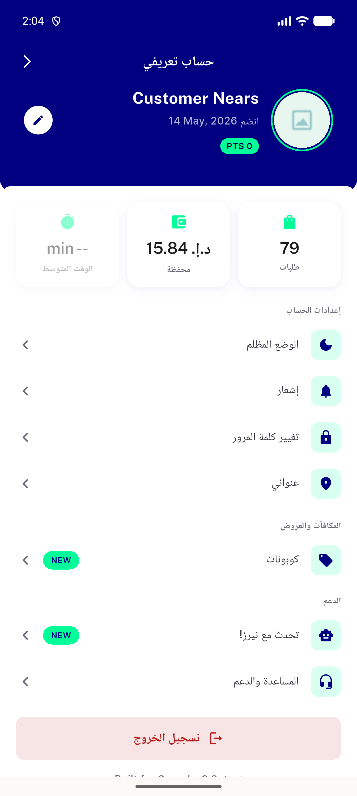

# QA Evidence — NEARS-2770

**PASS - navy hero consolidation confirmed pixel/behavioral parity live on profile_screen.dart + menu_profile_header_card.dart across loaded/guest/error states, EN+AR**

**9 screenshot(s).** Click any thumbnail for full resolution.

<table>
<tr>
<td align="center" width="33%"> menu error ar</td>
<td align="center" width="33%"> menu error</td>
<td align="center" width="33%"> menu guest</td>
</tr>
<tr>
<td align="center" width="33%"> menu loaded</td>
<td align="center" width="33%"> profile error ar</td>
<td align="center" width="33%"> profile error</td>
</tr>
<tr>
<td align="center" width="33%"> profile guest</td>
<td align="center" width="33%"> profile loaded</td>
<td align="center" width="33%"> profile loading attempt</td>
</tr>
</table>

---
*From `nears/docs/qa-evidence/NEARS-2770/` · public-repo scrub policy (no live secrets; verified clean).*
