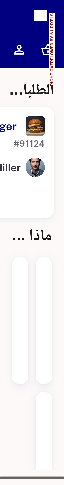

# QA Evidence — NEARS-2771

**PASS — AC1/AC2/AC3 confirmed live on emulator-5558, railHeight 188->200 clears the real on-device AR overflow (not just headless EN-equivalent), automated backstop 20/20 green**

**8 screenshot(s).** Click any thumbnail for full resolution.

<table>
<tr>
<td align="center" width="33%"> ac1 ar 1.3x home rail</td>
<td align="center" width="33%"> ac2 en 1.3x home rail</td>
<td align="center" width="33%"> ac3 ar 1.0x home rail</td>
</tr>
<tr>
<td align="center" width="33%"> ac3 en 1.0x home rail</td>
<td align="center" width="33%"> bug appbar overflow 320dp</td>
<td align="center" width="33%"> regression eta pill ar 1.0x nears2724</td>
</tr>
<tr>
<td align="center" width="33%"> regression eta pill en 1.0x</td>
<td align="center" width="33%"> worstcase eta pill ar 1.3x</td>
</tr>
</table>

### Other artifacts
- [`bug-appbar-overflow-320dp.log`](bug-appbar-overflow-320dp.log)

---
*From `nears/docs/qa-evidence/NEARS-2771/` · public-repo scrub policy (no live secrets; verified clean).*
