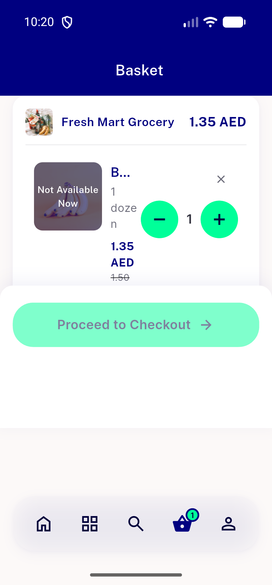
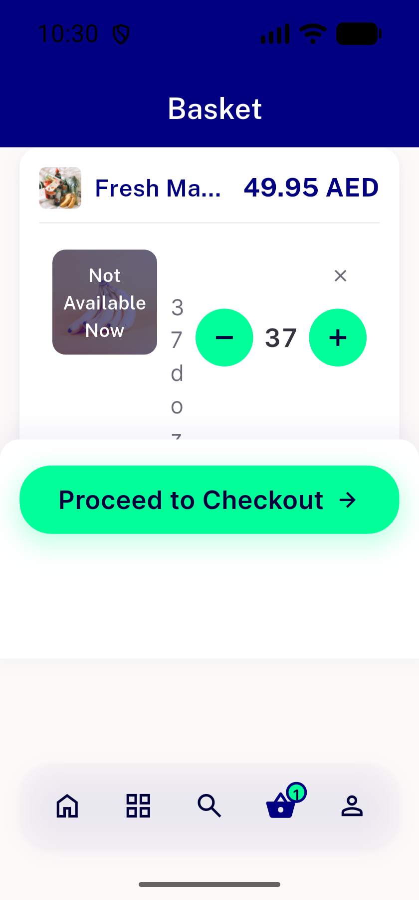
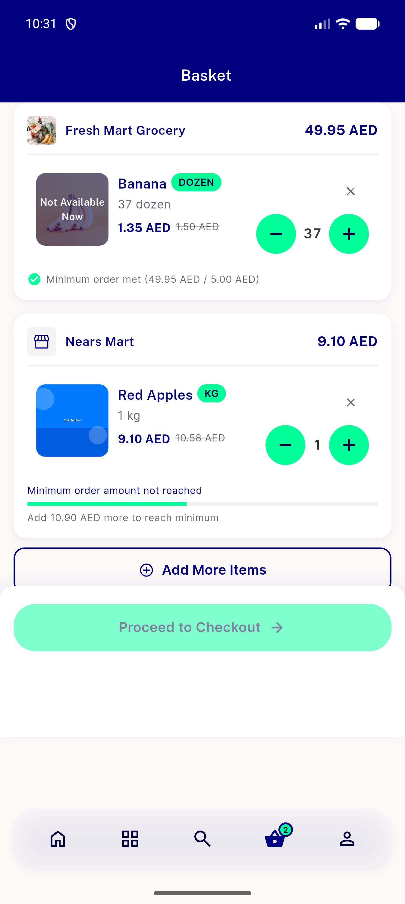

# QA Evidence — NEARS-2774

**PASS — AC1-4 demonstrated live at 320dp AR/EN (cold boot), 2-digit qty, 1.3x text-scale clamp; automated backstop 219/219 green**

**7 screenshot(s).** Click any thumbnail for full resolution.

<table>
<tr>
<td align="center" width="33%"> ac1 320dp ar qty1</td>
<td align="center" width="33%"> ac1 320dp ar qty12</td>
<td align="center" width="33%"> ac2 320dp en qty1</td>
</tr>
<tr>
<td align="center" width="33%"> ac3 320dp ar qty12 scale13</td>
<td align="center" width="33%"> ac3 320dp en qty37 scale13</td>
<td align="center" width="33%"> bug followup resize transient overflow visible 280dp</td>
</tr>
<tr>
<td align="center" width="33%"> regression 390dp plus en siblingrows</td>
</tr>
</table>

### Other artifacts
- [`followup-live-wm-resize-transient-overflow.log`](followup-live-wm-resize-transient-overflow.log)
- [`regression-nitemcard-1.1px-overflow-scale13.log`](regression-nitemcard-1.1px-overflow-scale13.log)

---
*From `nears/docs/qa-evidence/NEARS-2774/` · public-repo scrub policy (no live secrets; verified clean).*
