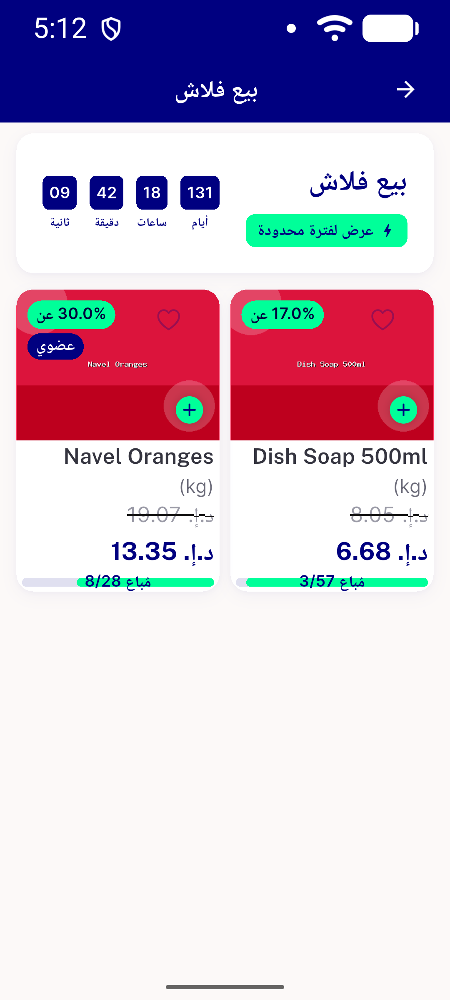

# QA Evidence — NEARS-2777

**Pre-verification: AR clean at real max 1.3x, EN overflow 3.0px discovered (ticket premise inverted)**

**3 screenshot(s).** Click any thumbnail for full resolution.

<table>
<tr>
<td align="center" width="33%"> ar 1.3x flashsale clean nav1</td>
<td align="center" width="33%"> en 1.3x flashsale overflow nav1</td>
<td align="center" width="33%"> en 1.3x flashsale overflow nav2</td>
</tr>
</table>

### Other artifacts
- [`bug-en-1.3x-flashsale-overflow.log`](bug-en-1.3x-flashsale-overflow.log)

---
*From `nears/docs/qa-evidence/NEARS-2777/` · public-repo scrub policy (no live secrets; verified clean).*
