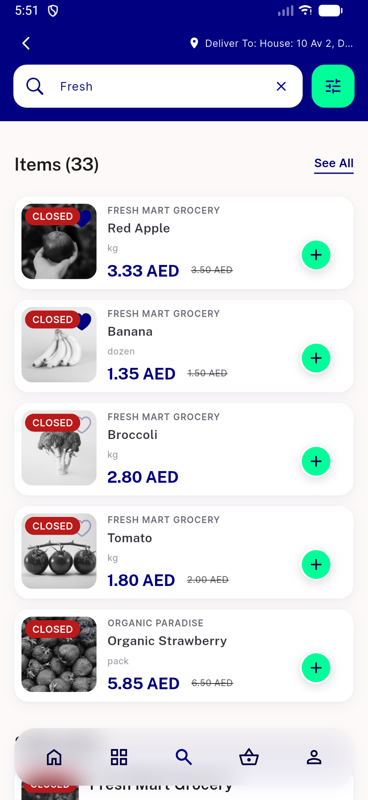
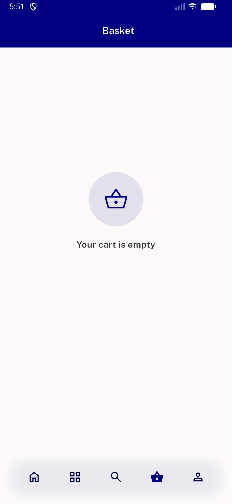
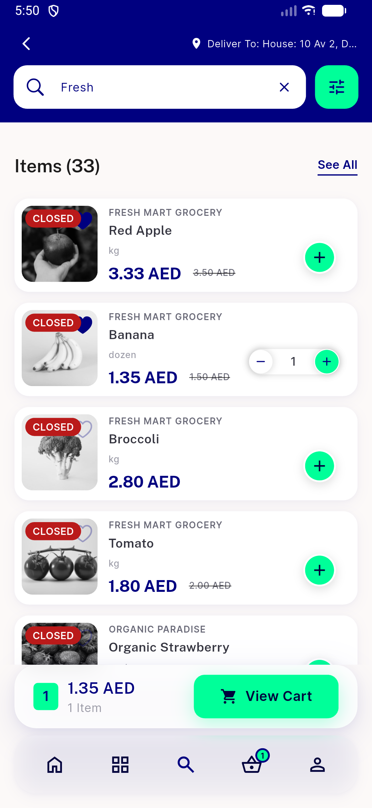

# QA Evidence — NEARS-2782

**PASS — NEARS-2782 cart badge scoped update, emulator-5560**

**4 screenshot(s).** Click any thumbnail for full resolution.

<table>
<tr>
<td align="center" width="33%"> ac1 search card flip to add</td>
<td align="center" width="33%"> ac1 search card qty1 stepper</td>
<td align="center" width="33%"> ac3 basket empty state</td>
</tr>
<tr>
<td align="center" width="33%"> ac4 sibling unaffected</td>
</tr>
</table>

---
*From `nears/docs/qa-evidence/NEARS-2782/` · public-repo scrub policy (no live secrets; verified clean).*
