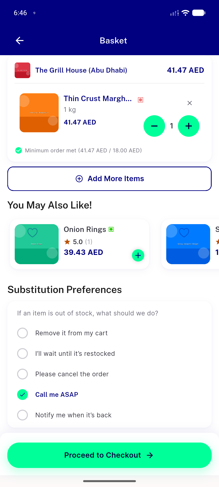

# QA Evidence — NEARS-2783

**regression-candidate CONFIRMED: reorder_helper.dart _openStore's fire-and-forget clearCartOnline() leaves a stale wrong-module cart line reachable at checkout on a forced clear-cart failure**

**4 screenshot(s).** Click any thumbnail for full resolution.

<table>
<tr>
<td align="center" width="33%"> bug clearcart null module 400 false empty</td>
<td align="center" width="33%"> cycle1 forced fail toast</td>
<td align="center" width="33%"> pass clearcart null module cycle1</td>
</tr>
<tr>
<td align="center" width="33%"> regression candidate reorder helper silent orphan</td>
</tr>
</table>

### Other artifacts
- [`bug-clearcart-null-module-400.log`](bug-clearcart-null-module-400.log)
- [`progress.md`](progress.md)
- [`regression-candidate-reorder-helper-silent-orphan.log`](regression-candidate-reorder-helper-silent-orphan.log)

---
*From `nears/docs/qa-evidence/NEARS-2783/` · public-repo scrub policy (no live secrets; verified clean).*
