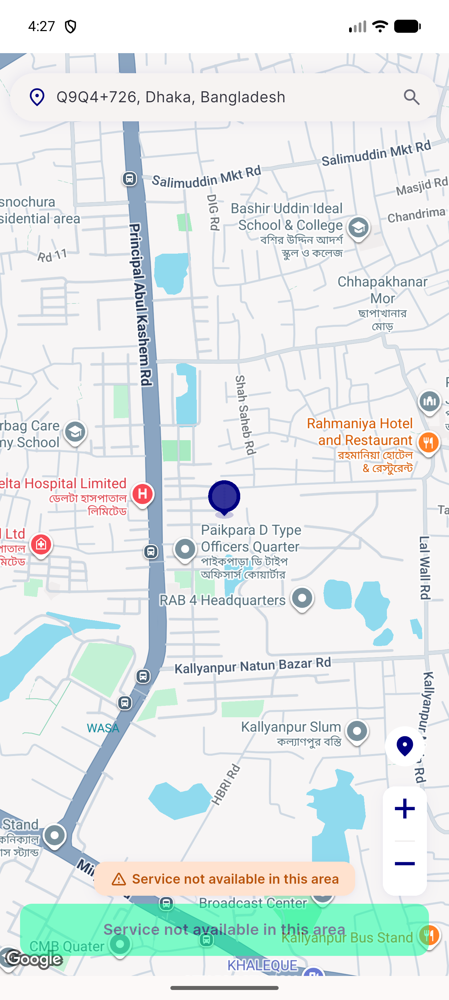

# QA Evidence — NEARS-2786

**PASS (AC1-3 demonstrated live; 1 pre-existing regression_bug found on cold first-run, not blocking)**

**1 screenshot(s).** Click any thumbnail for full resolution.

<table>
<tr>
<td align="center" width="33%"> ac1 splash nofetch mount</td>
</tr>
</table>

### Other artifacts
- [`ac1-ac2-ac3-paired-capture.log`](ac1-ac2-ac3-paired-capture.log)
- [`bug-cold-first-run-splash-route-mismatch.log`](bug-cold-first-run-splash-route-mismatch.log)

---
*From `nears/docs/qa-evidence/NEARS-2786/` · public-repo scrub policy (no live secrets; verified clean).*
