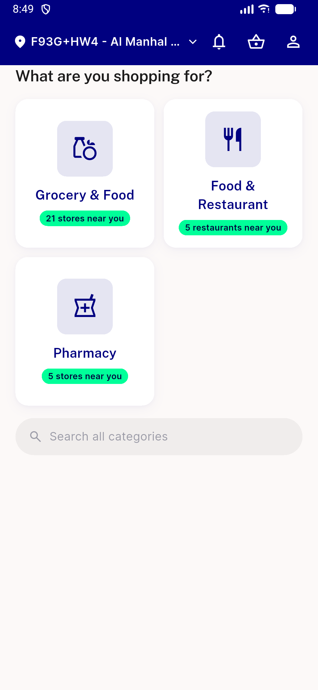
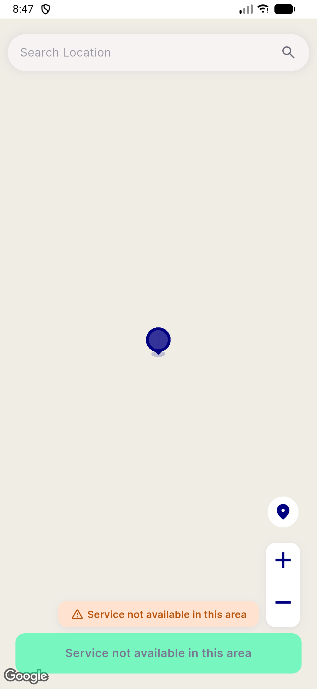

# QA Evidence — NEARS-2788

**PASS — AC1/AC2 demonstrated live on emulator-5560, cold-boot location resolution within 6s bound, pick-map fallback preserved, 203/203 flutter test pass**

**2 screenshot(s).** Click any thumbnail for full resolution.

<table>
<tr>
<td align="center" width="33%"> ac1 home resolved</td>
<td align="center" width="33%"> ac2 pickmap fallback</td>
</tr>
</table>

### Other artifacts
- [`bug-running-order-rail-prefetch-unresolved.log`](bug-running-order-rail-prefetch-unresolved.log)

---
*From `nears/docs/qa-evidence/NEARS-2788/` · public-repo scrub policy (no live secrets; verified clean).*
