# QA Evidence — NEARS-2792

**PASS — NEARS-2792 NAppBar 320dp overflow fix, emulator-5554**

**12 screenshot(s).** Click any thumbnail for full resolution.

<table>
<tr>
<td align="center" width="33%"><a href="ac1-home-320dp.png">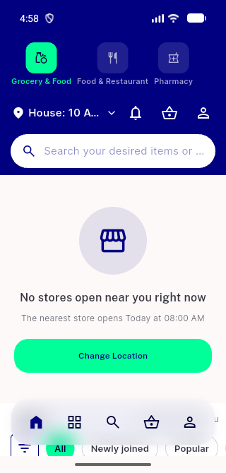</a> ac1 home 320dp</td>
<td align="center" width="33%"><a href="ac1-widgetbook-appbar-minimal-320dp.png">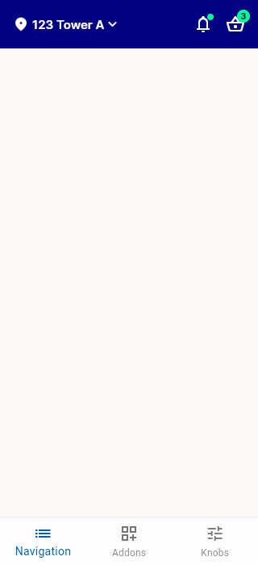</a> ac1 widgetbook appbar minimal 320dp</td>
<td align="center" width="33%"><a href="ac2-backbutton-360dp.png">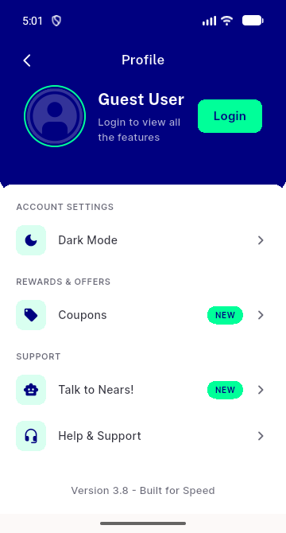</a> ac2 backbutton 360dp</td>
</tr>
<tr>
<td align="center" width="33%"><a href="ac2-home-360dp.png">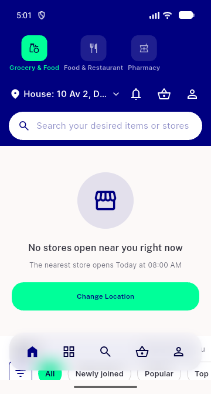</a> ac2 home 360dp</td>
<td align="center" width="33%"><a href="ac2-widgetbook-bellcart-labelledswitcher-320dp-rtl.png">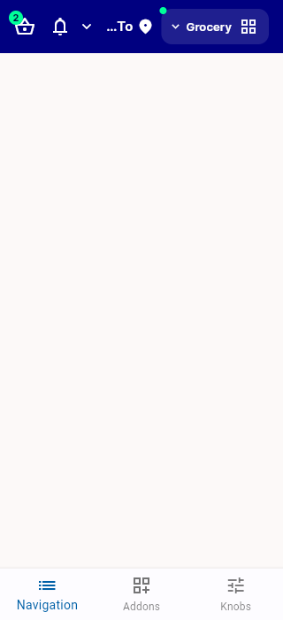</a> ac2 widgetbook bellcart labelledswitcher 320dp rtl</td>
<td align="center" width="33%"><a href="ac2-widgetbook-bellcart-labelledswitcher-320dp.png">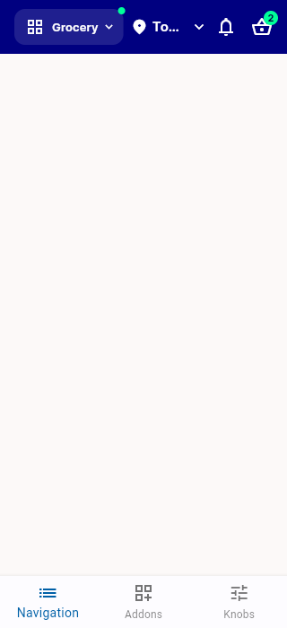</a> ac2 widgetbook bellcart labelledswitcher 320dp</td>
</tr>
<tr>
<td align="center" width="33%"><a href="ac2-widgetbook-bellcart-labelledswitcher-360dp.png">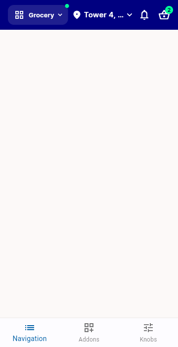</a> ac2 widgetbook bellcart labelledswitcher 360dp</td>
<td align="center" width="33%"><a href="ac2-widgetbook-bellcart-labelledswitcher-400dp.png">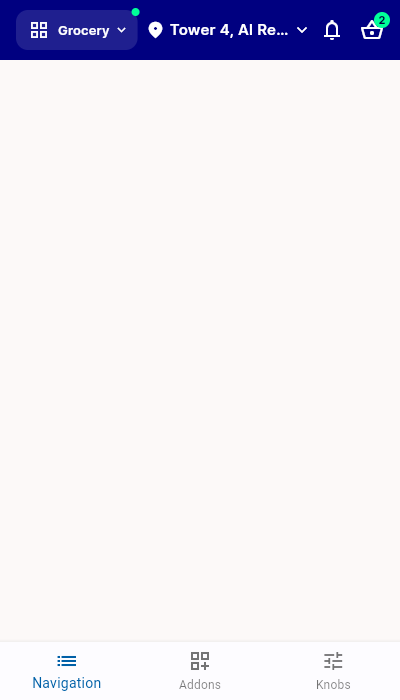</a> ac2 widgetbook bellcart labelledswitcher 400dp</td>
<td align="center" width="33%"><a href="ac3-widgetbook-appbar-showback-bell-cart-320dp.png">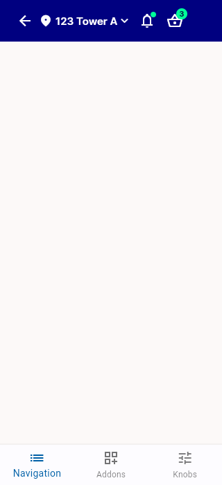</a> ac3 widgetbook appbar showback bell cart 320dp</td>
</tr>
<tr>
<td align="center" width="33%"><a href="baseline-home-normal-width.png">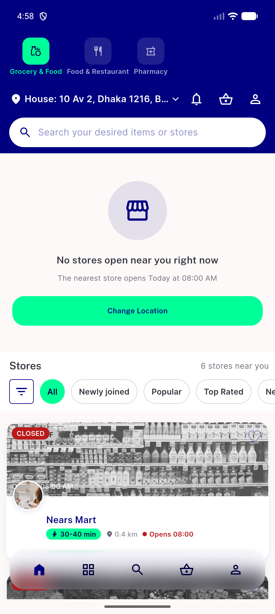</a> baseline home normal width</td>
<td align="center" width="33%"><a href="regression-categories-normal-width.png">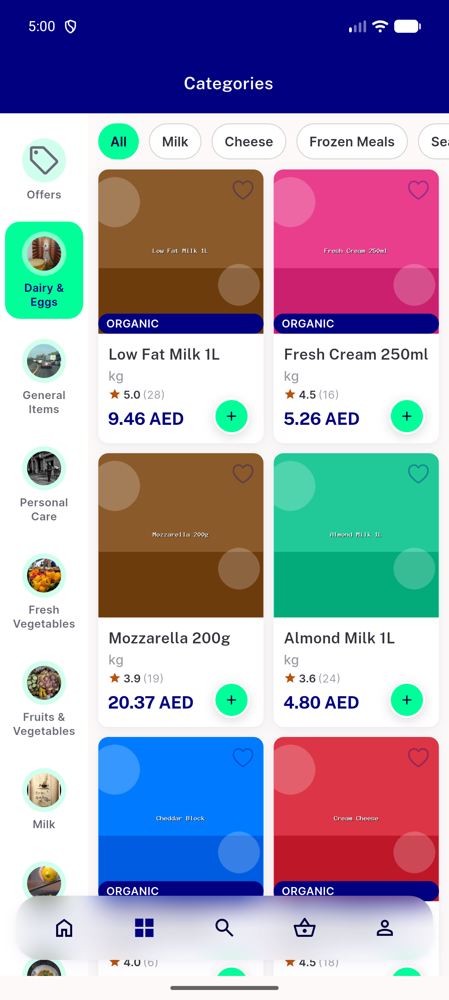</a> regression categories normal width</td>
<td align="center" width="33%"><a href="regression-profile-showback-normal-width.png">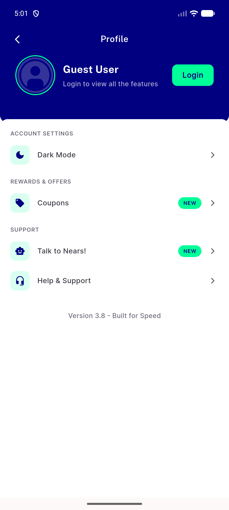</a> regression profile showback normal width</td>
</tr>
</table>

---
*From `nears/docs/qa-evidence/NEARS-2792/` · public-repo scrub policy (no live secrets; verified clean).*
