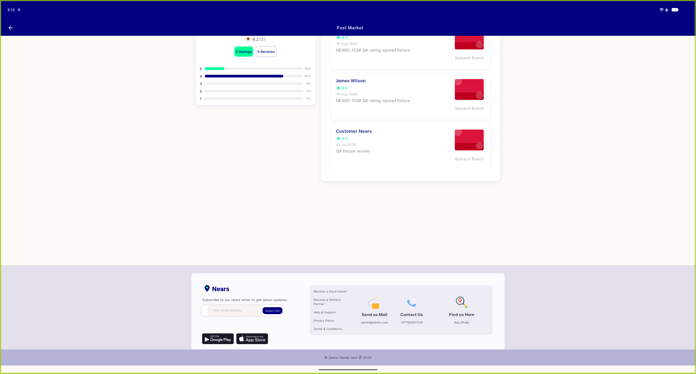
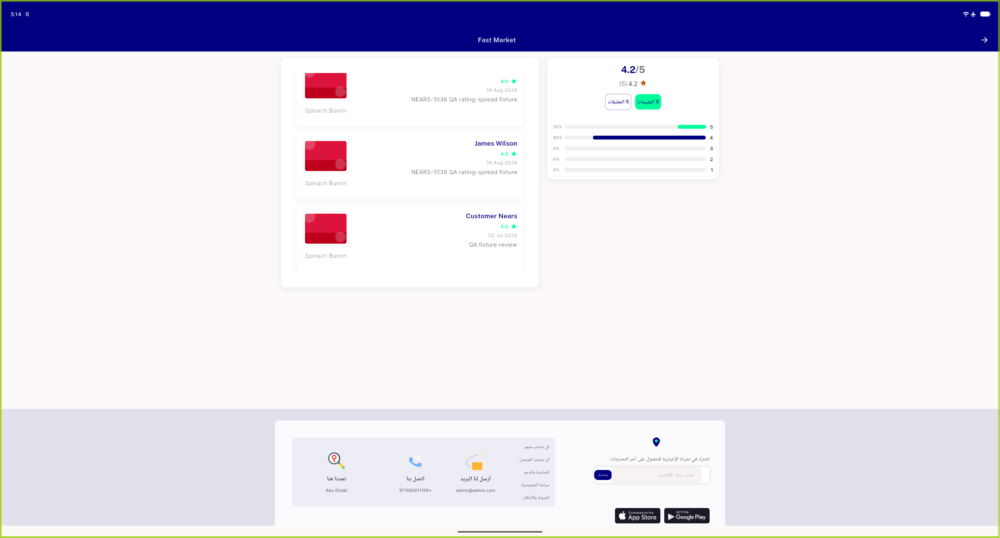

# QA Evidence — NEARS-2793

**PASS — review list desktop overflow fix, AC1-4 verified live LTR+RTL, AC5 automated-only (no <5-review store in DB)**

**2 screenshot(s).** Click any thumbnail for full resolution.

<table>
<tr>
<td align="center" width="33%"> ac1 ac2 desktop ltr</td>
<td align="center" width="33%"> ac3 desktop rtl</td>
</tr>
</table>

---
*From `nears/docs/qa-evidence/NEARS-2793/` · public-repo scrub policy (no live secrets; verified clean).*
