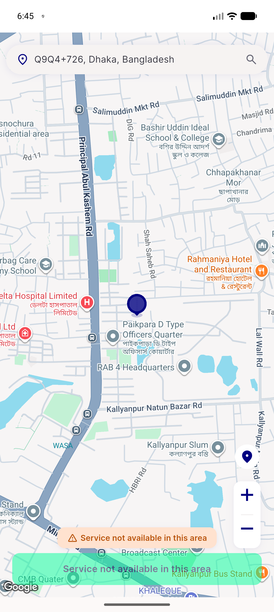
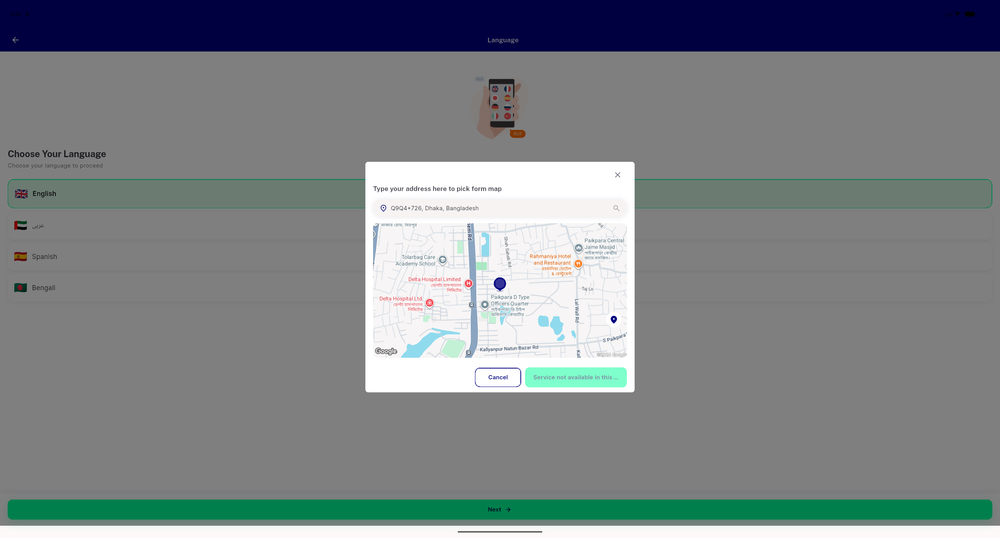
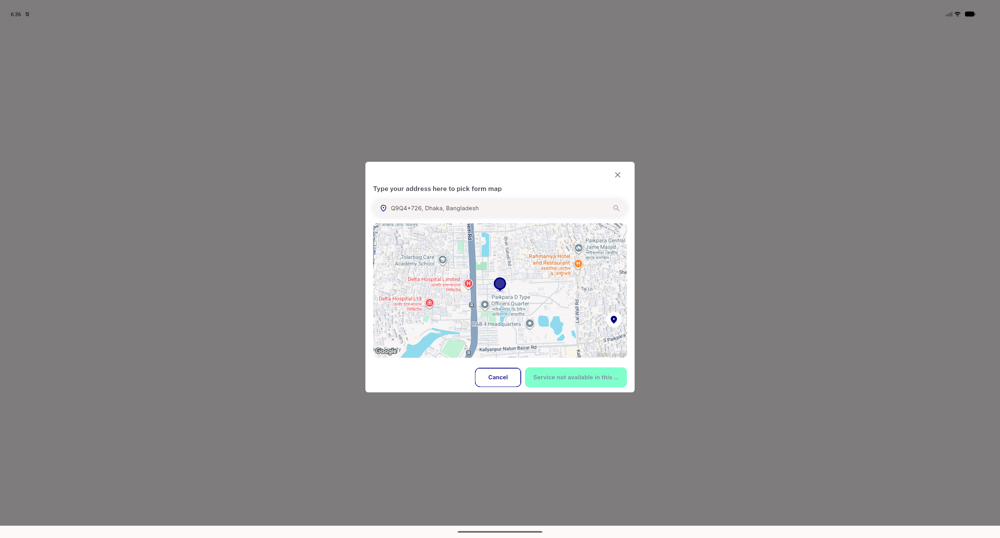
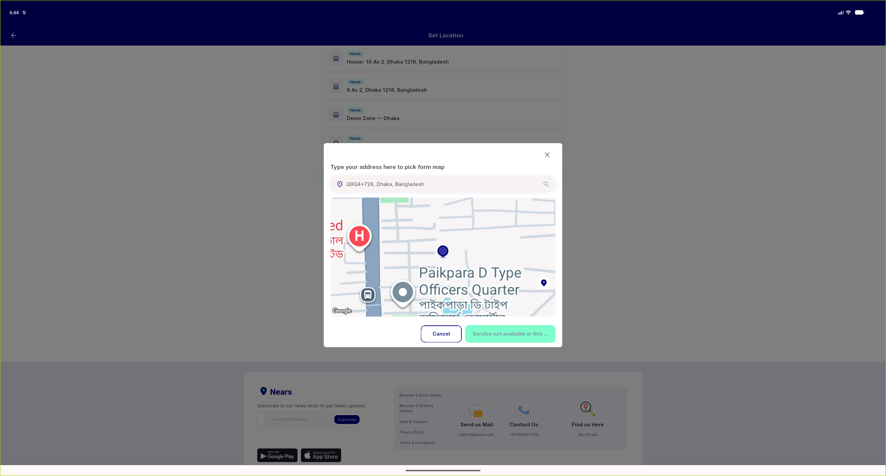

# QA Evidence — NEARS-2794

**Cycle-2 delta re-QA: PASS — AC2/AC3 desktop fixed, AC1/AC4 regression-clean**

**8 screenshot(s).** Click any thumbnail for full resolution.

<table>
<tr>
<td align="center" width="33%"> ac1 mobile cold launch pickmap</td>
<td align="center" width="33%"> ac1 mobile regression recheck cycle2</td>
<td align="center" width="33%"> ac2 desktop cold launch pickmap fixed</td>
</tr>
<tr>
<td align="center" width="33%"> ac3 desktop guestrelaunch pickmap fixed</td>
<td align="center" width="33%"> ac3 mobile guest relaunch pickmap</td>
<td align="center" width="33%"> ac4 desktop home nonsplash autofetch fires</td>
</tr>
<tr>
<td align="center" width="33%"> bug ac2 desktop autofetch fired</td>
<td align="center" width="33%"> bug ac3 desktop guestrelaunch autofetch fired</td>
</tr>
</table>

### Other artifacts
- [`ac1-mobile-regression-recheck-cycle2.log`](ac1-mobile-regression-recheck-cycle2.log)
- [`ac2-desktop-cold-launch-noautofetch.log`](ac2-desktop-cold-launch-noautofetch.log)
- [`ac3-desktop-guestrelaunch-noautofetch.log`](ac3-desktop-guestrelaunch-noautofetch.log)
- [`ac4-desktop-home-nonsplash-autofetch-fires.log`](ac4-desktop-home-nonsplash-autofetch-fires.log)
- [`bug-ac2-desktop-autofetch-fired.log`](bug-ac2-desktop-autofetch-fired.log)
- [`bug-ac3-desktop-guestrelaunch-autofetch-fired.log`](bug-ac3-desktop-guestrelaunch-autofetch-fired.log)
- [`regression-item-widget-overflow-desktop.log`](regression-item-widget-overflow-desktop.log)

---
*From `nears/docs/qa-evidence/NEARS-2794/` · public-repo scrub policy (no live secrets; verified clean).*
